<div align="center">

# AgroSense-RAG

**Upload a PDF. Ask it questions. Get answers grounded in what it actually says — with citations.**

[](LICENSE)


</div>

<br>

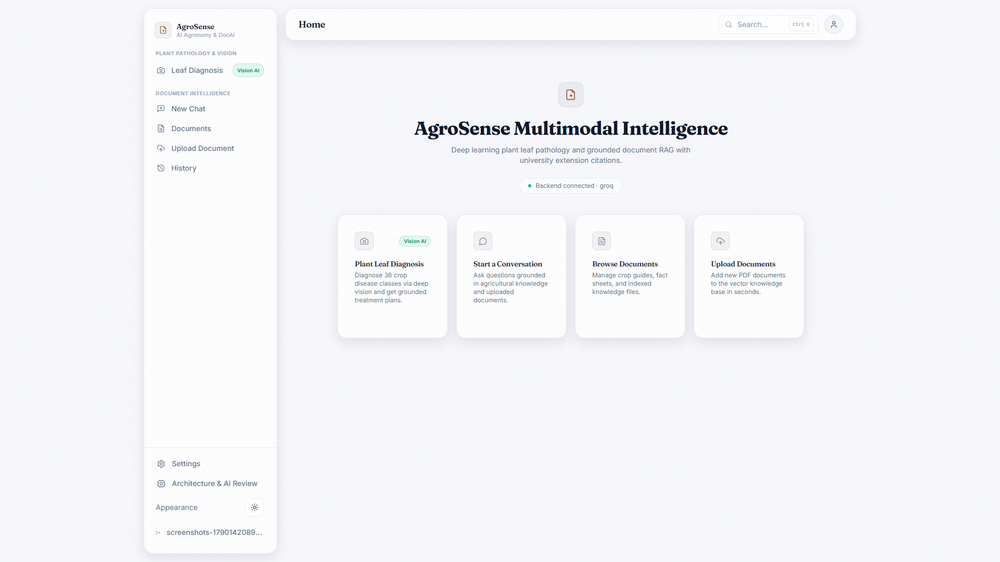

### Demo

A ~2:20 walkthrough recorded straight from the running app (signup → PDF upload/ingestion → grounded chat with streamed citations → multimodal leaf diagnosis → session history) — real screen capture, not a mockup.

[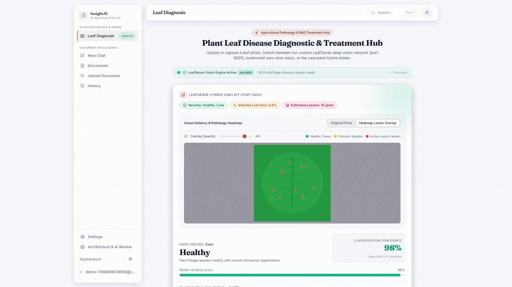](https://github.com/Udbhav748/AgroSense-RAG/blob/main/docs/assets/demo.mp4)

*Click the thumbnail to watch (`docs/assets/demo.mp4`) — GitHub's blob viewer plays it inline with full controls. For a version that autoplays directly inside this README, upload `docs/assets/demo.mp4` via a comment/PR attachment box on GitHub.com to get a `user-attachments` URL, then swap it in here.*

### Screenshots

<table>
<tr>
<td width="50%">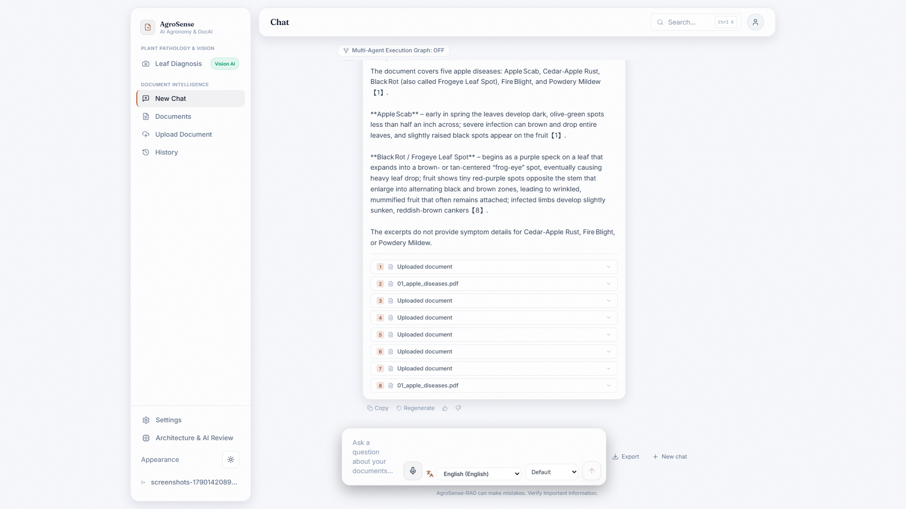</td>
<td width="50%">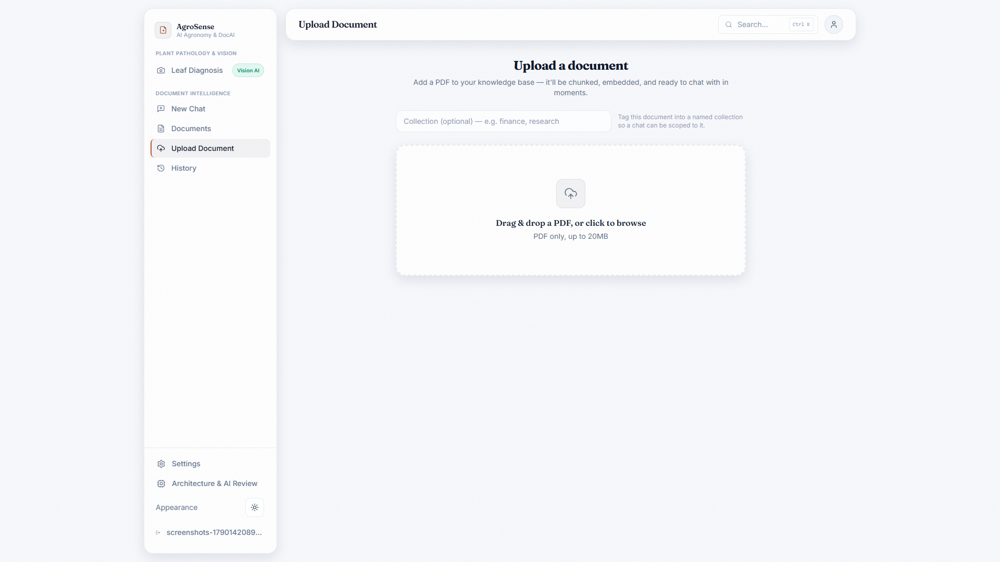</td>
</tr>
<tr>
<td align="center"><sub>Grounded chat, streamed answer with citations</sub></td>
<td align="center"><sub>PDF upload &amp; ingestion pipeline</sub></td>
</tr>
<tr>
<td width="50%">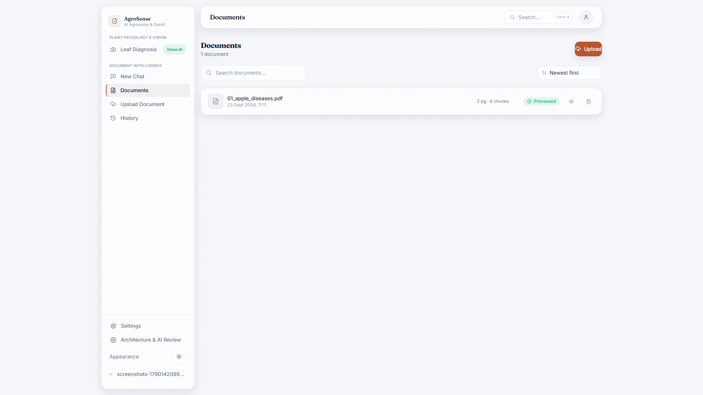</td>
<td width="50%">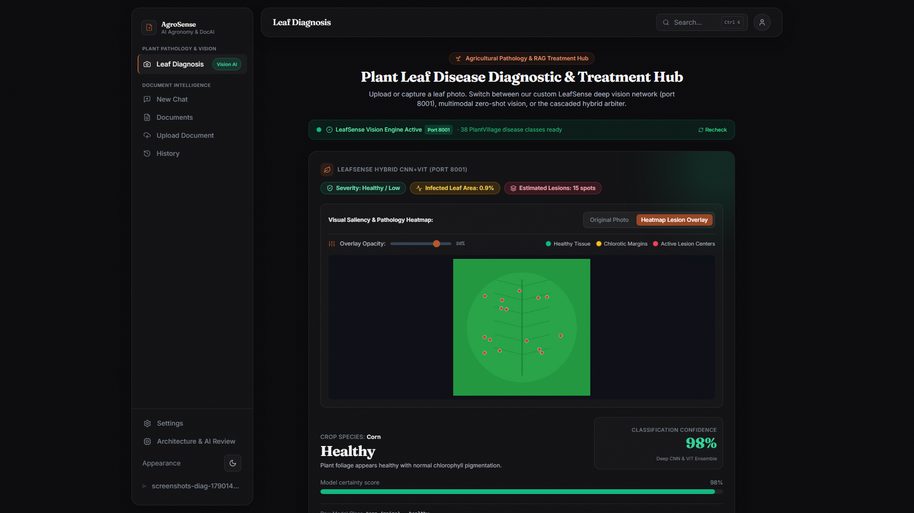</td>
</tr>
<tr>
<td align="center"><sub>Document library</sub></td>
<td align="center"><sub>Multimodal leaf diagnosis (vision + RAG)</sub></td>
</tr>
<tr>
<td width="50%">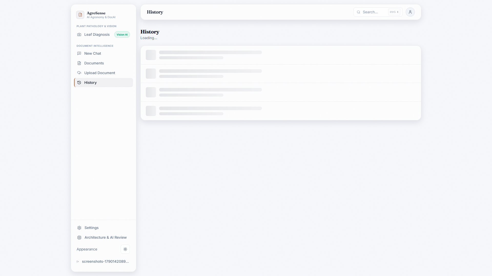</td>
<td width="50%">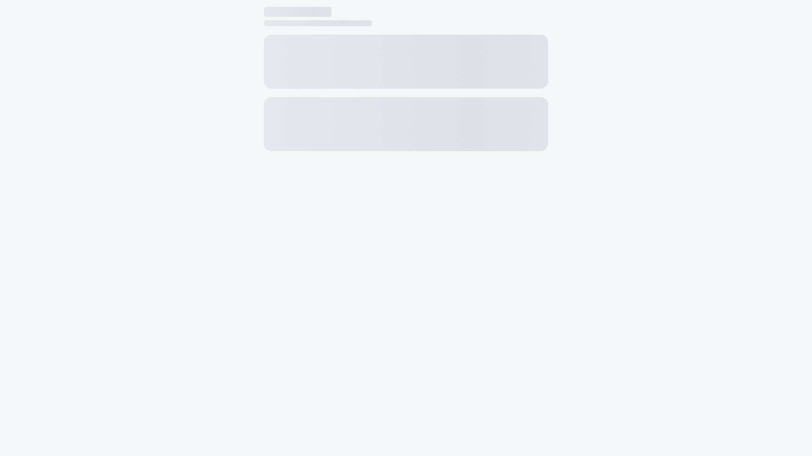</td>
</tr>
<tr>
<td align="center"><sub>Chat session history</sub></td>
<td align="center"><sub>Interactive architecture / vector graph explorer</sub></td>
</tr>
<tr>
<td width="50%">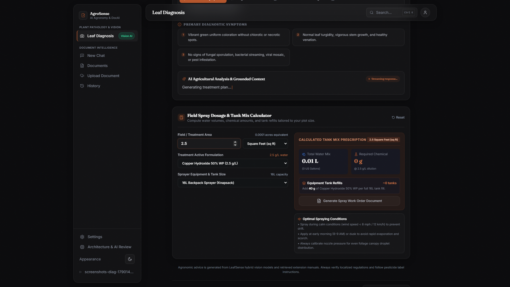</td>
<td width="50%">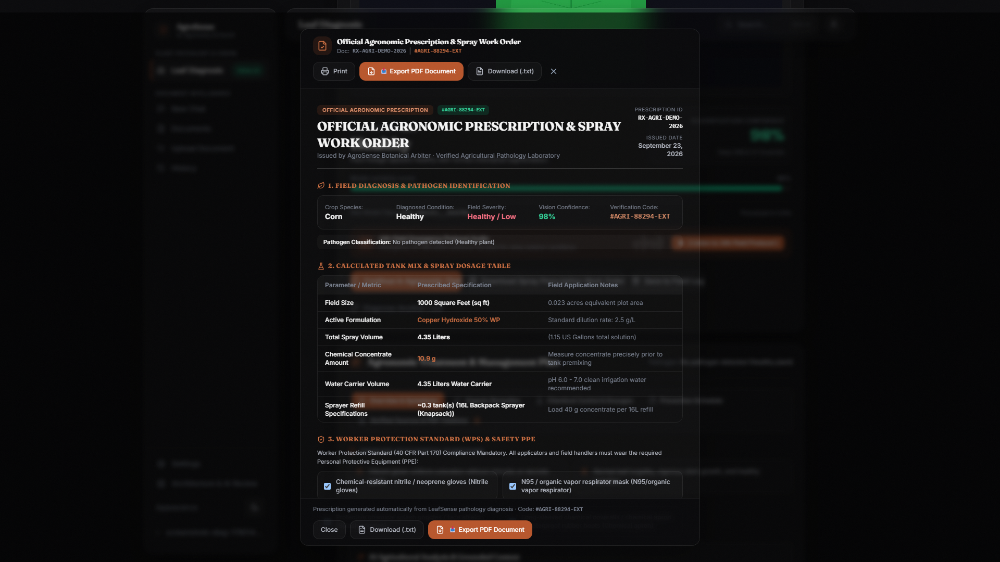</td>
</tr>
<tr>
<td align="center"><sub>Field spray dosage &amp; tank-mix calculator</sub></td>
<td align="center"><sub>Auto-generated spray prescription work order</sub></td>
</tr>
<tr>
<td width="50%">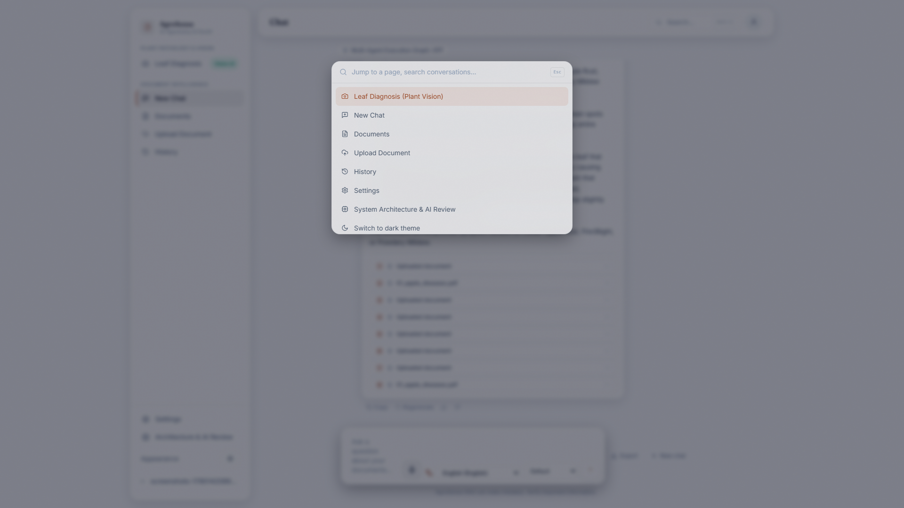</td>
<td width="50%">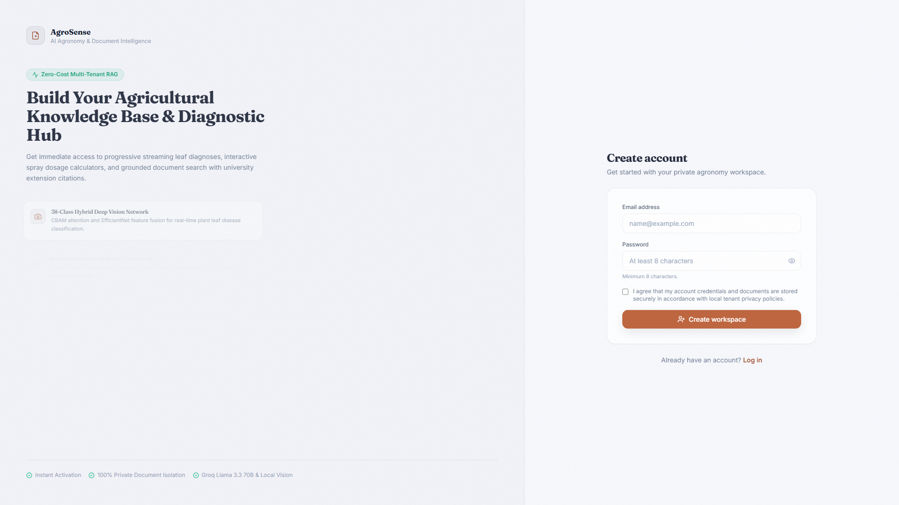</td>
</tr>
<tr>
<td align="center"><sub>Global command palette (Cmd/Ctrl+K)</sub></td>
<td align="center"><sub>Signup / account creation</sub></td>
</tr>
</table>

## Table of contents

- [What is AgroSense-RAG](#what-is-agrosense-rag)
- [Key capabilities](#key-capabilities)
- [Why this architecture](#why-this-architecture)
- [System architecture](#system-architecture)
- [Agent workflow](#agent-workflow)
- [RAG pipeline](#rag-pipeline)
- [Multimodal / vision](#multimodal--vision)
- [Memory & sessions](#memory--sessions)
- [Tools](#tools)
- [Security & privacy](#security--privacy)
- [Observability](#observability)
- [Evaluation & benchmarks](#evaluation--benchmarks)
- [Hard cases & failure recovery](#hard-cases--failure-recovery)
- [Performance](#performance)
- [Cost](#cost)
- [Tech stack](#tech-stack)
- [Project structure](#project-structure)
- [Installation](#installation)
- [Environment variables](#environment-variables)
- [Docker](#docker)
- [API reference](#api-reference)
- [Reproduce the results](#reproduce-the-results)
- [Documentation map](#documentation-map)
- [Current limitations](#current-limitations)
- [Roadmap](#roadmap)
- [License](#license)

## What is AgroSense-RAG

**30 seconds:** A full-stack Retrieval-Augmented Generation app. Upload a PDF, it's chunked, embedded, and indexed into FAISS; a React chat UI then answers questions about it, streaming a live "agent trace" as it plans, retrieves, grades, and — if the first attempt is ungrounded — corrects itself, always citing the exact passages an answer came from.

**Deeper:** The backend (`backend/`, FastAPI) is not scaffolding — every route in `app/api/v1/routes/` (`health`, `documents`, `query`, `auth`, `admin`, `approvals`, `metrics`) is wired to a real service. A chat turn runs through a small, dependency-free state machine (`app/services/agent_graph/`, plus the simpler `ChatService` used by the non-streaming path) rather than an LLM-framework agent runtime — deliberately, see [Why this architecture](#why-this-architecture). Two abstractions are injected rather than imported directly: `VectorStore` (FAISS today) and `LLMClient` (Gemini or Groq), so orchestration code never touches a concrete SDK. The frontend (`frontend/`, React + Vite + Tailwind) sits behind JWT-based per-user login, with per-tenant document/session isolation when `DATABASE_URL` is set. The project went through several rounds of self-audit ("Module 10" evaluation, `docs/MODULE10_*`) that found and fixed two real bugs — see [Hard cases & failure recovery](#hard-cases--failure-recovery).

## Key capabilities

- **Grounded chat with chunk-level citations.** Every answer is generated only from retrieved chunks (or, when the corrective loop escalates, web results); the response carries `sources`, one entry per contributing chunk/result with its own excerpt — never a bare model reply.
- **Streamed agent trace.** `POST /chat/stream` (Server-Sent Events) emits `plan → retrieve → grade → generate/correct → answer` as it happens, token-by-token for the answer itself, consumed by the frontend via `fetch` + a hand-parsed `ReadableStream` (`EventSource` can't send the required `Authorization` header or a POST body).
- **Corrective RAG loop.** Retrieval is graded `insufficient`/`weak`/`good` by a score threshold; weak/insufficient grades can pull in a web search fallback (off by default) before generation. An ungrounded first answer regenerates once with an explicit "you didn't use the context" instruction, then escalates to a web-augmented regeneration if still ungrounded — capped at 3 total `generate()` calls per request.
- **Hybrid retrieval.** FAISS semantic search fused with a BM25 lexical index by default (`HYBRID_SEARCH_ENABLED=true`), plus an opt-in cross-encoder reranking stage (`RERANKING_ENABLED`), both config-gated and A/B-measured against a semantic-only baseline (`docs/OPERATIONS.md`).
- **Multi-modal ingestion (opt-in, off by default).** Embedded figures extracted and persisted, captioned by Gemini into searchable `source="image_caption"` chunks, ruled-line tables reduced to markdown and indexed as `source="table"` chunks, and a vision-QA path that answers directly from a page raster when retrieval scores weak — each behind its own flag (`IMAGE_EXTRACTION_ENABLED`, `IMAGE_CAPTIONING_ENABLED`, `TABLE_EXTRACTION_ENABLED`, `VISION_QA_ENABLED`).
- **Plant-disease diagnosis from a photo.** `POST /chat/diagnose` sends an uploaded leaf image to LeafSense (a separate, optional vision service over HTTP); the predicted disease becomes the query and runs through the same retrieve → grade → correct pipeline as a text question.
- **Individual user accounts.** `POST /auth/signup`/`/auth/login` issue JWTs (`app/core/auth.py`); each user gets a private tenant, scoping documents and chat sessions per-person when `DATABASE_URL` is set. A separate `X-API-Key` path exists for non-browser/service clients.
- **RBAC and human-approval gates.** Admin-only document deletion (`ADMIN_CLIENT_NAMES`), and deployment-toggleable approval requirements on web search and document deletion (`app/services/approval_service.py`, `app/api/v1/routes/approvals.py`).
- **OCR fallback for scanned PDFs.** Pages with no extractable text layer are rasterized and OCR'd via `pytesseract` (`OCR_DPI` configurable) automatically — no separate upload path.
- **Semantic response cache.** An in-memory LRU cache keyed by embedding cosine similarity for near-duplicate queries (`app/services/cache_service.py`, `app/services/agent_graph/cache_node.py`).
- **Prometheus metrics.** `GET /metrics` exposes request counts/latencies, retrieval-chunk distributions, rerank scores, token/cost counters, loop-cap rate in standard exposition format.
- **Rate limiting.** In-memory sliding-window limiter, 60 req/min per identity, applied to both auth paths.
- **Structured JSON logging and a typed exception hierarchy** — every domain error subclasses `AppError` (`app/core/exceptions.py`) and carries its own HTTP status; one global handler in `app/core/error_handlers.py` maps it automatically.

## Why this architecture

| Decision | Why |
|---|---|
| Hand-rolled state machine, not LangGraph/CrewAI | The agent's control flow is a fixed, small sequence (plan → retrieve → grade → generate → correct); a general graph runtime buys nothing here and adds a dependency + debugging surface. Confirmed in code: `rag_service.py` opens with "Deliberately plain Python — no LangChain/LangGraph agent runtime." `app/services/agent_graph/` is a **custom** node/edge state graph the project built itself, not the `langgraph` package — `langgraph` does not appear in `requirements.txt`. |
| FAISS `IndexFlatIP` over a managed vector DB | Exact (not approximate) inner-product search is fast enough at this project's document-count scale, persisted to a single on-disk file with a mirrored `metadata.json` — no external service to run for local dev/small deployments. |
| Sentence-Transformers (`all-MiniLM-L6-v2`) over a hosted embeddings API | Local, free, no per-call cost or network dependency for the embed step; small enough to run on CPU. |
| Two swappable LLM providers (Gemini, Groq) behind one `LLMClient` interface | `FallbackLLMClient` retries against the secondary provider if the primary's own retries are exhausted — single-hop failover without coupling orchestration code to either SDK. |
| Threshold-based retrieval grading, not an LLM judge | Cheap (no extra LLM call) and fast; explicitly documented as a proxy for relevance, not a real semantic check (see [Current limitations](#current-limitations)). |
| Confirm-then-delete + optional approval gate on document deletion | `confirm=true` prevents accidental deletes from a stray request; `DOCUMENT_DELETE_REQUIRES_APPROVAL` adds a second, deployment-policy gate on top for higher-stakes environments. |
| In-memory store by default, Postgres opt-in via `DATABASE_URL` | Keeps local dev and free-tier deployments (Render) dependency-free; Postgres (with Alembic migrations auto-applied at startup) is a straight upgrade path for durable multi-user persistence without code changes. |

## System architecture

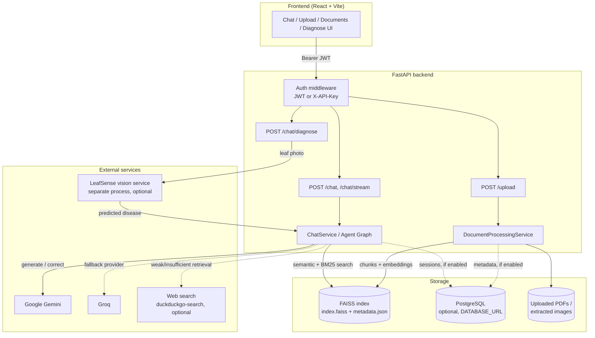

## Agent workflow

`app/services/agent_graph/` is a **custom, dependency-free node/edge state machine** (`graph.py`, `engine.py`, `nodes.py`, `state.py`) — not the LangGraph package. The simpler, non-streaming `ChatService` (`rag_service.py`) runs an equivalent sequence directly in plain Python; both are described by the same flow:

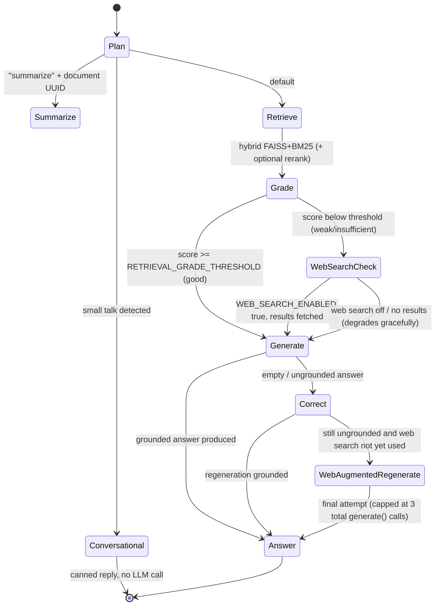

## RAG pipeline

**Ingestion** (`POST /upload` → `documents.py` → `DocumentProcessingService`):

1. **Validate** — file type/size (`validation_service.py`, `MAX_UPLOAD_SIZE_MB`).
2. **Save to disk** (`upload_service.py`).
3. **Extract text per page** with PyMuPDF (`document_service.py`); pages with no text layer fall back to OCR (`pytesseract`, `OCR_DPI`).
4. **Chunk** with `langchain-text-splitters`, 1000 chars / 200 overlap (`chunking_service.py`).
5. **Embed** with Sentence Transformers `all-MiniLM-L6-v2` (`embedding_service.py`), L2-normalized so inner product equals cosine similarity.
6. **Index** into FAISS `IndexFlatIP`, persisted to `backend/vector_store/index.faiss` with row-aligned `metadata.json` (`faiss_vector_store.py`). Writes are `threading.Lock`-guarded so concurrent `/upload` and `DELETE` calls can't corrupt the index.
7. If enabled: extract embedded figures/tables (`document_parser.py`, `table_extraction_service.py`) and caption images via a vision-capable Gemini call (`image_captioning_service.py`), indexed as additional searchable chunks.

**Retrieval and generation** (`POST /chat` → `query.py` → `ChatService`/agent graph):

1. **Plan** — keyword/regex router, no LLM call: `conversational`, `summarize`, or `retrieve`.
2. **Retrieve** — FAISS semantic search fused with BM25 (`hybrid_search.py`) by default; optional cross-encoder reranking (`reranker.py`/`reranking_service.py`) narrows to `RETRIEVAL_TOP_K`.
3. **Grade** — top chunk's score vs. `RETRIEVAL_GRADE_THRESHOLD`/`RETRIEVAL_MIN_SCORE` sorts into `insufficient`/`weak`/`good` (a threshold check, not a semantic judgment).
4. **Generate** — Gemini or Groq (`llm_provider.py`) answers from a grounded prompt (`prompt_builder.py`) that asks the model to cite sources inline; the API response strips that inline section and surfaces sources structurally instead.
5. **Correct** — an empty/ungrounded first answer triggers one "you didn't use the context" regeneration, then an optional web-augmented regeneration; capped at 3 `generate()` calls total.
6. **Citations** — `sources` returns one entry per contributing chunk/web result, each with its own `chunk_id`/`url` and a ~200-character excerpt.

## Multimodal / vision

Two independent multimodal surfaces exist, both real and code-verified, kept clearly separate:

- **Document multimodal RAG (opt-in, off by default):** `IMAGE_EXTRACTION_ENABLED`, `IMAGE_CAPTIONING_ENABLED`, `TABLE_EXTRACTION_ENABLED`, `VISION_QA_ENABLED` — extracts embedded figures, captions them via Gemini into searchable chunks, extracts ruled-line tables to markdown chunks, and answers directly from a page raster when text retrieval is weak. `GET /documents/{id}/images` lists extracted images from a per-document manifest; `/health` reports which of these are live.
- **LeafSense plant-disease classification (separate, optional service):** `POST /chat/diagnose` sends an uploaded leaf photo to LeafSense (its own repo/process, TensorFlow/Keras) over HTTP (`vision_client.py`); the returned disease prediction (with `confidence`, flagged `low_confidence` below `VISION_CONFIDENCE_THRESHOLD`) becomes the query for the same retrieve → grade → correct pipeline as a text question. This is a standalone vision-model prediction from LeafSense, distinct from — and not blended into — the RAG pipeline's own retrieval-quality metrics; no LeafSense classifier accuracy benchmark is included in this repo, only its role as an upstream input to the RAG answer.

## Memory & sessions

Chat history is server-side per `session_id` (`session_store.py`; `postgres_session_store.py` when `DATABASE_URL` is set), capped at 1000 sessions with LRU eviction and 50 turns per session, no TTL. With Postgres enabled, `GET /chat/sessions` lists a user's past conversations and `GET /chat/sessions/{id}` resumes one (frontend History page, `useChat`). Without Postgres, sessions still work for the active conversation but there's nothing to list afterward. `history` in a `/chat` request body is optional — only the most recent 6 turns are used to build the prompt.

## Tools

| Tool | Purpose | Input | Output | Failure handling |
|---|---|---|---|---|
| FAISS retrieval (`retrieval_service.py`, `hybrid_search.py`) | Fetch relevant chunks for a query | query text, `top_k`, `min_score` | scored chunks | empty result set feeds the `insufficient` grade, not an exception |
| Cross-encoder reranker (`reranker.py`) | Re-score the candidate pool before truncation | candidate chunks + query | reordered chunks | disabled via `RERANKING_ENABLED=false`; not on the default path |
| Web search (`web_search_service.py`) | Fallback context when retrieval is weak/insufficient | query text | web result snippets + URLs | `duckduckgo-search` is an unofficial scraper with no SLA; silent rate-limit/zero-results is treated as "no web results" and falls through gracefully, no exception surfaced to the caller |
| LeafSense vision client (`vision_client.py`) | Classify a leaf photo | image bytes | crop, disease, confidence | `502` if LeafSense is unreachable at `VISION_SERVICE_URL`; timeout via `VISION_SERVICE_TIMEOUT_SECONDS` |
| Gemini/Groq LLM client (`gemini_client.py`, `groq_client.py`, `fallback_llm_client.py`) | Answer generation | grounded prompt | generated text | `tenacity`-based retries on the primary; `FallbackLLMClient` retries once against the secondary provider if configured, then fails |
| Semantic cache (`cache_service.py`) | Serve near-duplicate queries without a fresh LLM call | query embedding | cached response | cache miss falls through to the normal pipeline; no error path |

## Security & privacy

**Implemented:**
- Every endpoint except `/health`, `/metrics`, `/auth/signup`, `/auth/login` requires either an `X-API-Key` header or a JWT `Authorization: Bearer` header (`app/core/auth.py`); missing/invalid credentials return `401`.
- Per-user accounts with bcrypt-hashed passwords (`user_service.py`, `bcrypt` dependency) and JWT issuance/verification (`PyJWT`, `JWT_SECRET_KEY`/`JWT_ALGORITHM`/`JWT_EXPIRY_MINUTES`).
- Per-tenant isolation of documents and chat sessions when `DATABASE_URL` is set (`tenant_service.py`, `test_tenant_isolation.py`).
- RBAC: `ADMIN_CLIENT_NAMES` gates `DELETE /documents/{id}` and cross-tenant document listing (`app/core/permissions.py`, `test_permissions.py`).
- Human-approval gates: `DOCUMENT_DELETE_REQUIRES_APPROVAL` and an equivalent web-search approval flag require an explicit `approved=true` on top of normal auth (`approval_service.py`, `routes/approvals.py`).
- Rate limiting: in-memory sliding window, 60 requests/min per identity, applied to both auth paths.
- PII detection (`pii_service.py`) and prompt-injection/jailbreak detection (`prompt_injection_service.py`), both covered by dedicated tests (`test_prompt_injection_service.py`, `test_security.py`).
- Structured audit logging of feedback and admin-relevant events (`core/logging.py`).
- API keys are SHA-256-hashed at startup; only hashes are kept in memory (`.env.example`'s `API_KEYS` documentation, `core/auth.py`).

**Encryption at rest (application-level, full scope)**: every genuinely sensitive persisted text surface is encrypted with AES-256-GCM before being written to disk and decrypted on read (`app/core/encryption.py`) — chat content (`ChatTurn.content`), session titles (`ChatSession.title`), feedback comments, uploaded PDF files, and FAISS `metadata.json` chunk text, each with an appropriate authenticated-associated-data binding (session/message/document/chunk ID). FAISS metadata is decrypted once at index load and re-encrypted once at save — the in-memory copy BM25 lexical search needs stays plaintext for the process's lifetime, so this adds zero per-query overhead. Real per-field tests (78 total) include a genuine PyMuPDF text-extraction round trip after encrypting/decrypting an uploaded PDF, and a genuine BM25 lexical-match round trip after encrypting/decrypting FAISS metadata — not just byte-equality checks. There is no key-rotation procedure, and this is application-level encryption, not platform-level (e.g. an encrypted disk volume) — disclosed, not fixed.

**Explicitly NOT implemented:**
- No password reset or refresh-token flow for JWT auth; a token is simply valid for `JWT_EXPIRY_MINUTES` and then the user logs in again.
- No API key rotation, expiration, or revocation endpoint — only a `.env` edit + restart.
- No GDPR/HIPAA/DPDP or other compliance certification of any kind — having these security controls is not the same as a formal compliance assessment.
- No key-rotation procedure for the encryption key above.

## Observability

| Item | Status |
|---|---|
| Structured JSON logging (`core/logging.py`) | **IMPLEMENTED** |
| `X-Request-ID` on every response, for log correlation | **IMPLEMENTED** |
| Typed exception hierarchy → automatic HTTP status mapping (`core/error_handlers.py`) | **IMPLEMENTED** |
| `GET /health` — liveness, LLM provider config booleans, multimodal capability flags | **IMPLEMENTED** |
| `GET /metrics` — Prometheus exposition format (latency percentiles, tool/LLM call counts, tokens/cost, loop-cap rate) | **IMPLEMENTED** |
| `backend/eval/metrics_report.py` — parses JSON logs into latency percentiles, error-rate-by-category, token/cost totals, feedback acceptance rate | **IMPLEMENTED** (offline tool, not a live dashboard) |
| Prometheus/Grafana monitoring stack (`docker-compose.monitoring.yml`, `monitoring/`) | **OPTIONAL** — separate compose file, not part of the default `docker-compose.yml` stack |
| Automated alerting engine (`app/core/alerting.py::AlertEngine` — threshold rules, debounce, recovery events) | **IMPLEMENTED, tested, run on demand** — validated end-to-end (metric → threshold → alert → payload) with real and synthetic inputs; **not continuously scheduled** against a live target, since no persistent deployment exists to poll |
| Text dashboard (`monitoring/dashboard.py` — availability, latency, error rate, tool success, retry activity, requests, tokens, cost) | **IMPLEMENTED**, dependency-free, on-demand over a captured log file — not a hosted Grafana-style live service |
| Bounded local availability measurement (`eval/module10/runners/run_availability_eval.py`) | **IMPLEMENTED** — real `GET /health` probes against a genuinely spawned local process; explicitly not a production SLO |
| Live production dashboard / continuous production monitoring | **NOT DEPLOYED** — no current cloud deployment (see [Current limitations](#current-limitations)) |

## Evaluation & benchmarks

The full backend test suite: **1081 tests collected** via `pytest --collect-only` on the current tree (1080 passed, 1 skipped, 0 failed — `main` branch, `cd backend && pytest`). Coverage spans the API end-to-end, RAG orchestration, LLM/Groq/Gemini clients and fallback, hybrid search/reranking, vision/diagnose, document/table/image extraction, agent-graph state machine, real concurrent branch execution, sessions, permissions, tenant isolation, security, full-scope encryption at rest, structured output, provider A/B evaluation, observability/alerting, load/concurrency, and human-evaluation infrastructure (`backend/eval/module10/` — see `docs/MODULE10_FINAL_SUBMISSION.md` for the full evidence-backed breakdown).

`backend/eval/` — three independent, code-verified tools (see `backend/eval/README.md`):

| Tool | What it measures | Source |
|---|---|---|
| `run_eval.py` | Planner routing accuracy (confusion matrix), Task Success Rate, a lexical-overlap groundedness proxy, Injection Resistance, Source Accuracy | live run against `dataset_v1.json`/`dataset_v2.json`; requires a real `GEMINI_API_KEY` |
| `metrics_report.py` | Latency percentiles, error rate by taxonomy, token/cost usage, feedback Acceptance Rate | parses backend's own JSON logs + `backend/feedback/feedback.jsonl` |
| `docs/HUMAN_EVAL.md` rubric | 1–5 scores across correctness, helpfulness, completeness, safety, tone, groundedness, citation quality | manual, human-rated |

Module 10 results, as reported in `docs/MODULE10_FINAL_SUBMISSION.md`/`docs/MODULE10_RESULTS.md` (repo-internal audit documents, updated through a 9-phase evaluation arc — figures below are **as-measured in-repo**, each with a cited artifact, not independently re-run for this README pass):

| Area | Result | Label |
|---|---|---|
| RAG retrieval (hybrid + rerank) | P@5 0.6435, Recall@5 0.8080, Hit@5 0.9130, MRR 0.8783 | measured |
| Faithfulness (20-case golden set, post root-cause fix) | 0.7093 (up from a pre-fix 0.6485; historical unverified baseline 0.9420) | measured, one case (`eval-potato-02`) still unresolved |
| Agent planner | Accuracy 0.9333, Macro F1 0.9475, Planning Success 1.0, Loop Rate 0.0 | measured |
| Security (PII recall / unauthorized access / injection / jailbreak / false refusal / data leak) | 1.0 / 0.0 / 0.0 / 0.0 / 0.0 / 0.0 | measured |
| Structured output (production path) | enabled by default on `POST /chat`; 17-case parser dataset, Field Accuracy 1.0, Parser Correctness 1.0 | measured |
| Encryption at rest (full scope) | Chat content/titles, feedback comments, uploaded PDFs, FAISS metadata — all AES-256-GCM, 78 tests passing incl. real PyMuPDF/BM25 round trips | measured |
| Provider A/B (groq `openai/gpt-oss-120b` vs. gemini `gemini-3.5-flash`) | Faithfulness 0.6824 vs. 0.5158, no provider declared superior | measured, single run, no significance claimed |
| Observability | real 35-request sample: error rate 0.1429, P50/P95/P99 0.1/0.2/163.3ms; bounded-local availability 1.0 (15/15 probes) | measured, local only |
| Load/concurrency (real HTTP boundary) | `/health` 63.75–94.61 RPS, 0 errors; `/chat` 11.66→1.99 RPS across concurrency 1→20, full timeout saturation at concurrency=20, clean recovery | measured, local only |
| Human evaluation | 24 cases, 7 rubric dimensions, **1 real reviewer**; two-reviewer/IAA infrastructure built and tested | IAA not yet measured — pending an independent second reviewer, disclosed, not fabricated |
| Parallel execution (diagnose workflow: vision + weather) | real concurrent `asyncio` branches, serial mean 0.6598s vs parallel mean 0.3544s, 46.3% measured reduction | measured, one workflow only (non-streaming diagnose); streaming diagnose and the main chat corrective loop remain sequential |
| Full test suite | 1001 passed, 1 skipped, 0 failed (1002 collected) | measured |

Every figure above is cited to a specific `backend/eval/module10/reports/*.json` artifact and reproduction command in `docs/MODULE10_RESULTS.md` and `docs/MODULE10_FINAL_SUBMISSION.md` — nothing here is a marketing estimate. None of these numbers should be read as production-scale, cloud-validated, or clinical-grade claims; see [Current limitations](#current-limitations) and `docs/MODULE10_FINAL_SUBMISSION.md`'s Limitations section for the full, explicit list.

## Hard cases & failure recovery

Two genuine bugs were found and fixed during self-audit, documented in-repo rather than hidden:

- **Mislabeled LLM-provider-failure regression** (`docs/PHASE3_PRODUCTION_HARDENING_REPORT.md`): the corrective-generation loop was silently relabeling LLM provider failures (timeouts, rate limits) as confident "not in the documents" answers — indistinguishable from a genuine grounded refusal. Root-caused and fixed with a distinct error sentinel; re-verified live on the two cases that first exposed it.
- **A self-bypassable authorization gate**, found and fixed during the same audit cycle (referenced in `docs/MODULE10_FINAL_AUDIT.md`).

Hand-run demo scenarios exist at `docs/demo/DEMO.md` — one successful, one failing, and one recovery path per capability.

Graceful-degradation behaviors verified in code:
- Web search failures (rate-limited/zero-result scraper) fall through to the normal "couldn't find that" reply rather than raising.
- OCR fallback: if the `tesseract` binary is missing/broken, the affected page is skipped and logged as a warning rather than failing the whole upload.
- Provider fallback (`FallbackLLMClient`) is single-hop only — if both the primary and fallback LLM providers are down, the request fails; there's no health-based routing back to the primary.

## Performance

No dedicated load-testing artifact was found in this repo (no `k6`/`locust`/latency-under-load report located in `docs/` or `backend/eval/`). What is measured:

- `processing_time` is returned per `/chat` response (see API reference below) — a real, request-level wall-clock figure, not a benchmark aggregate.
- `backend/eval/metrics_report.py` computes latency percentiles (p50/p95/p99) from live JSON logs when run against real traffic — a tool, not a pre-computed number this README can restate without running it.

No performance numbers are stated here as repo-verified facts beyond these two mechanisms; treat any specific latency figure elsewhere in older docs as unverified for this pass.

## Cost

`COST_PER_1K_TOKENS` (Gemini, `$0.00025` default) and `GROQ_COST_PER_1K_TOKENS` (`$0.0006` default) in `backend/.env.example` are used only to log a **rough per-generation cost estimate**, not billed/metered usage — stated explicitly in the config comments. `backend/eval/metrics_report.py` aggregates these into a total token/cost figure from real logs, but only when run against real traffic; no aggregate dollar figure from a completed run was found checked into the repo, so none is restated here.

## Tech stack

**Backend**

| Category | Technology |
|---|---|
| Framework | FastAPI, Uvicorn, Pydantic v2 (`pydantic-settings`) |
| Document parsing | PyMuPDF, `pytesseract` (OCR fallback) |
| Chunking | `langchain-text-splitters` |
| Embeddings | Sentence Transformers (`all-MiniLM-L6-v2`) |
| Vector store | FAISS (`faiss-cpu`, `IndexFlatIP`); optional `pgvector` store (`pgvector_store.py`) |
| Lexical/hybrid search | `rank-bm25` |
| LLM providers | Google Gemini (`google-genai`), Groq (`groq`) |
| Retry logic | `tenacity` |
| Web search | `duckduckgo-search` |
| Auth | `PyJWT`, `bcrypt` |
| Persistence | SQLAlchemy, `psycopg2-binary`, Alembic (migrations), PostgreSQL |
| Cloud sync | `boto3` (S3, optional) |
| Testing | `pytest`, `pytest-asyncio` |

**Frontend**

| Category | Technology |
|---|---|
| Framework | React 18, Vite |
| Routing | React Router 6 |
| Styling | Tailwind CSS |
| Animation | Framer Motion |
| HTTP | Axios (`services/api.js`) |
| Icons | Lucide React |
| PDF rendering | `pdfjs-dist` |
| Testing | Vitest, Testing Library (jsdom), Playwright (present in devDependencies) |
| Linting | ESLint 9 |

## Project structure

```
AgroSense-RAG/
├── backend/
│   ├── app/
│   │   ├── api/v1/routes/     # health, documents, query, auth, admin, approvals, metrics
│   │   ├── core/               # config, auth, security, exceptions, error handlers, database, logging, permissions
│   │   ├── models/             # Pydantic schemas, DB models
│   │   └── services/
│   │       ├── agent_graph/    # custom dependency-free node/edge state machine
│   │       ├── tools/          # tool registry + implementations
│   │       └── ...             # chunking, embedding, FAISS/pgvector stores, RAG orchestration,
│   │                            # Gemini/Groq clients, hybrid search, reranking, vision QA,
│   │                            # image/table extraction, session stores, tenant/user services
│   ├── alembic/                 # DB migrations
│   ├── eval/                    # run_eval.py, metrics_report.py, module10/
│   └── tests/                   # 96 test files, 1081 tests collected
├── docs/                        # architecture, API reference, operations, Module 10 audit trail
├── monitoring/                  # optional Prometheus/Grafana stack
└── frontend/
    └── src/
        ├── pages/                # Home, Chat, Upload, Documents, Diagnose, History, Settings, Admin, Login, Signup
        ├── components/           # chat/, upload/, diagnose/, documents/, command/, layout/, ui/
        ├── contexts/             # Auth, Theme, Toast
        ├── hooks/                # useAuth, useChat, useUpload, useDiagnose, useTheme, useToast
        └── services/             # api client, chat/document/diagnose/feedback/admin/health services
```

## Installation

### Backend (from `backend/`)

```bash
pip install -r requirements.txt
cp .env.example .env        # then set GEMINI_API_KEY (required)
uvicorn app.main:app --reload
```

Runs at `http://localhost:8000` (interactive docs at `/docs`).

### Frontend (from `frontend/`)

```bash
npm install
cp .env.example .env        # leave VITE_API_BASE_URL unset in dev
npm run dev
```

Runs at `http://localhost:5173`.

### Tests

```bash
cd backend && pytest                       # full suite
cd backend && pytest tests/test_main.py    # single file
```

```bash
cd frontend
npm run lint
npx vitest run
npm run build
```

## Environment variables

Full, current tables with defaults and descriptions live in `backend/.env.example` and `frontend/.env.example` — this section highlights the load-bearing ones; **see those files for the complete, authoritative list** (both are extensively commented in-repo).

**Backend — required**

| Variable | Description |
|---|---|
| `GEMINI_API_KEY` | Google Gemini API key. Only strictly required variable. |
| `API_KEY` (or `API_KEYS`) | Shared secret(s) for `X-API-Key` auth on non-browser clients. |

**Backend — notable optional**

| Variable | Default | Description |
|---|---|---|
| `DATABASE_URL` | unset | PostgreSQL connection string; enables durable multi-user persistence, RBAC, sessions. Alembic migrations auto-apply at startup. |
| `JWT_SECRET_KEY` | unset | Required for `/auth/signup`/`/auth/login` to work. |
| `LLM_PROVIDER` / `FALLBACK_LLM_PROVIDER` | `gemini` / unset | Primary/fallback LLM provider (`gemini` or `groq`). |
| `HYBRID_SEARCH_ENABLED` | `true` | BM25 + FAISS fusion. |
| `RERANKING_ENABLED` | `false` | Cross-encoder reranking pass. |
| `WEB_SEARCH_ENABLED` | `false` | Web search fallback for weak/insufficient retrieval. |
| `IMAGE_EXTRACTION_ENABLED` / `IMAGE_CAPTIONING_ENABLED` / `TABLE_EXTRACTION_ENABLED` / `VISION_QA_ENABLED` | `false` each | Multi-modal ingestion/answering features. |
| `VISION_SERVICE_URL` | `http://127.0.0.1:8001` | LeafSense vision service address. |
| `ADMIN_CLIENT_NAMES` | unset | Grants admin role (document deletion) to named API clients; requires `DATABASE_URL`. |
| `DOCUMENT_DELETE_REQUIRES_APPROVAL` | `false` | Human-approval gate on delete. |
| `METRICS_BEARER_TOKEN` | unset | Requires a bearer token to scrape `/metrics`. |

**Frontend**

| Variable | Default | Description |
|---|---|---|
| `VITE_API_BASE_URL` | `/api` (dev proxy) | Backend origin. Leave unset in dev — Vite proxies `/api` to `localhost:8000`. |

## Docker

The repo ships four Compose files, code-verified by their presence at the repo root:

- `docker-compose.yml` — local dev stack: `postgres`, `leafsense`, `backend`, `frontend`, plus named volumes for uploads/vector store/Postgres data.
- `docker-compose.prod.yml` — production variant.
- `docker-compose.caddy.yml` — adds Caddy for HTTPS/reverse-proxy termination (`Caddyfile` at repo root).
- `docker-compose.monitoring.yml` — optional Prometheus/Grafana stack (`monitoring/`).

```bash
docker compose up          # local dev stack (postgres, backend, frontend, leafsense)
docker compose -f docker-compose.yml -f docker-compose.prod.yml up   # production overlay
```

## API reference

Every endpoint except `/health`, `/metrics`, `/auth/signup`, `/auth/login` requires an `X-API-Key` header or a JWT `Authorization: Bearer <token>`. Full typed reference: [`docs/API_REFERENCE.md`](docs/API_REFERENCE.md).

| Method | Endpoint | Auth | Description |
|---|---|---|---|
| `GET` | `/health` | — | Liveness/readiness, LLM provider config booleans, multimodal capability flags. |
| `GET` | `/metrics` | optional | Prometheus text exposition format. |
| `POST` | `/auth/signup` / `/auth/login` | — | Create account / log in; returns a JWT. |
| `POST` | `/upload` | required | Upload, chunk, embed, and index a PDF. |
| `DELETE` | `/documents/{id}?confirm=true` | required | Remove a document and its vectors. |
| `POST` | `/chat` | required | Ask a question; grounded answer + `sources`. |
| `POST` | `/chat/stream` | required | Same as `/chat`, as Server-Sent Events. |
| `POST` | `/chat/diagnose` | required | Leaf photo → LeafSense prediction → grounded, cited answer. |
| `POST` | `/chat/feedback` | required | Record thumbs up/down on an answer. |
| `GET`/`DELETE` | `/chat/sessions[/{id}]` | required | List/resume/delete a conversation. Requires `DATABASE_URL`. |

**`POST /chat` request:**

```json
{ "query": "What is a project according to the PMP document?", "top_k": 5, "min_score": 0.3 }
```

**`POST /chat` response (abridged):**

```json
{
  "answer": "A project is a temporary endeavor undertaken to create a unique product...",
  "sources": [
    { "document_id": "ae845151-...", "chunk_id": "ae845151-...-0", "excerpt": "A project is a temporary endeavor...", "url": null }
  ],
  "tool_used": "retrieval",
  "answer_source": "documents"
}
```

`tool_used` is one of `retrieval`, `summarization`, `diagnose`, `web_search`, or `none`. `answer_source` is `documents`, `web`, or `mixed`.

**`POST /chat/stream`** — same body, `text/event-stream` response: `{"type": "trace", "stage": ...}` events, `{"type": "answer_chunk", "text": ...}` per streamed token, then one final `{"type": "done", "payload": {...}}` (identical shape to `POST /chat`'s response) or `{"type": "error", ...}`.

Full interactive OpenAPI docs are available at `/docs` while the backend is running.

## Reproduce the results

```bash
cd backend
pytest                                   # full suite (1081 tests collected on this tree)
python -m eval.run_eval --dataset dataset_v1.json     # planner/groundedness/injection metrics (needs GEMINI_API_KEY + indexed docs)
python -m eval.metrics_report                          # latency/cost/acceptance from real logs
```

See [`backend/eval/README.md`](backend/eval/README.md) for exact flags and dataset versioning, and [`docs/REPRODUCE_MODULE10.md`](docs/REPRODUCE_MODULE10.md) for the Module 10 package's own reproduction commands (states its external-dependency requirements explicitly).

## Documentation map

Every link below was checked against the actual `docs/` directory contents at write time.

| Document | Covers |
|---|---|
| [`docs/ARCHITECTURE.md`](docs/ARCHITECTURE.md) | Architecture detail, framework-choice rationale, nodes/edges topology diagram, data models |
| [`docs/API_REFERENCE.md`](docs/API_REFERENCE.md) | Full typed API spec, SSE wire formats, code snippets |
| [`docs/OPERATIONS.md`](docs/OPERATIONS.md) | Deployment (Render, EC2), retrieval ablation study |
| [`docs/DESIGN_REVIEW.md`](docs/DESIGN_REVIEW.md) | Design rationale Q&A |
| [`docs/NOT_APPLICABLE.md`](docs/NOT_APPLICABLE.md) | Explicitly out-of-scope items and why |
| [`docs/CHECKLIST.md`](docs/CHECKLIST.md) | Production readiness checklist |
| [`docs/HUMAN_EVAL.md`](docs/HUMAN_EVAL.md) | 7-dimension manual scoring rubric |
| [`docs/RAG_BENCHMARK_REPORT.md`](docs/RAG_BENCHMARK_REPORT.md) | Retrieval benchmark scorecard, with its own historical/unverified vs. refreshed caveat |
| [`docs/MODULE10_FINAL_AUDIT.md`](docs/MODULE10_FINAL_AUDIT.md) | Terminal Module 10 audit |
| [`docs/MODULE10_EVIDENCE_INDEX.md`](docs/MODULE10_EVIDENCE_INDEX.md) | Requirement → evidence → command index |
| [`docs/REPRODUCE_MODULE10.md`](docs/REPRODUCE_MODULE10.md) | Exact reproduction commands |
| [`docs/PHASE3_PRODUCTION_HARDENING_REPORT.md`](docs/PHASE3_PRODUCTION_HARDENING_REPORT.md) | The corrective-loop regression story |
| [`docs/demo/DEMO.md`](docs/demo/DEMO.md) | Hand-run demo scenarios |
| [`backend/eval/README.md`](backend/eval/README.md) | Evaluation harness usage and metric definitions |

## Current limitations

- **Single, unsharded FAISS index** — one file serves every document, no per-tenant vector isolation (though writes are lock-guarded against corruption).
- **Document history is per-browser, not server-side** — `GET /documents` exists and is tenant-scoped, but the Documents page still reads `localStorage`.
- **Retrieval grading is a score threshold, not a semantic judgment** — a chunk can score high while off-topic, or score just under threshold while relevant.
- **Groundedness in `run_eval.py` is a lexical-overlap proxy**, not a real faithfulness check.
- **Web search is off by default and fragile when on** — `duckduckgo-search` has no SLA and can silently rate-limit from cloud IPs.
- **Provider fallback is single-hop** — no health-based routing or automatic recovery to the primary.
- **No live cloud deployment currently.** Self-hostable via Docker Compose (including a production EC2 path); has run on Render/Vercel historically per `docs/OPERATIONS.md`.
- **Faithfulness re-verification after the Phase 3 fix covered only 2 targeted cases**, not the full benchmark/human-eval datasets (a stated quota-conservation tradeoff).
- **Human evaluation is single-reviewer** — no inter-annotator agreement measured.
- **No automated alerting** on `/health`/`/metrics` — nothing currently pages on threshold breach.
- **No dedicated load-testing artifact found in the repo** — no throughput/latency-under-load numbers to report.

## Roadmap

- [ ] Multi-tenant / shardable vector store, replacing the single FAISS file
- [ ] Persistent, server-side document history in the frontend (backend endpoint exists; UI still uses `localStorage`)
- [ ] Multi-document collections/workspaces
- [ ] File types beyond PDF
- [ ] Automated alerting on `/health`/`/metrics`
- [x] Per-user JWT authentication alongside API keys
- [x] Chat history browsing (`GET /chat/sessions`, History page)
- [x] RBAC (admin-gated document deletion, cross-tenant listing)
- [x] Human-approval gates (web search, document deletion)
- [x] Multi-modal RAG (image captioning, table extraction, vision QA)

## License

MIT © Udbhav Narawat — see [LICENSE](LICENSE).
