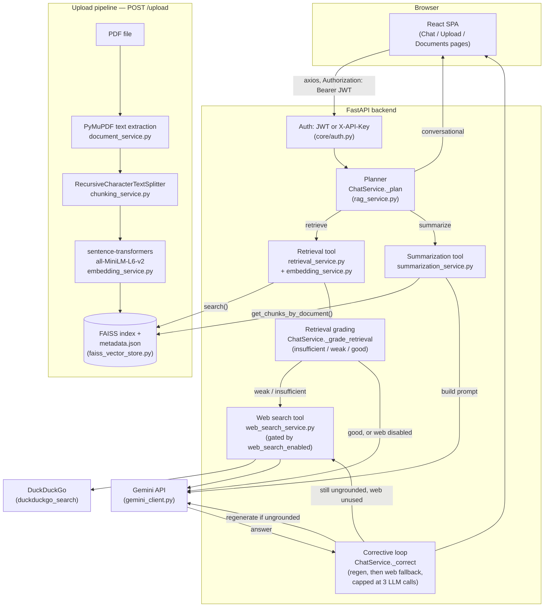
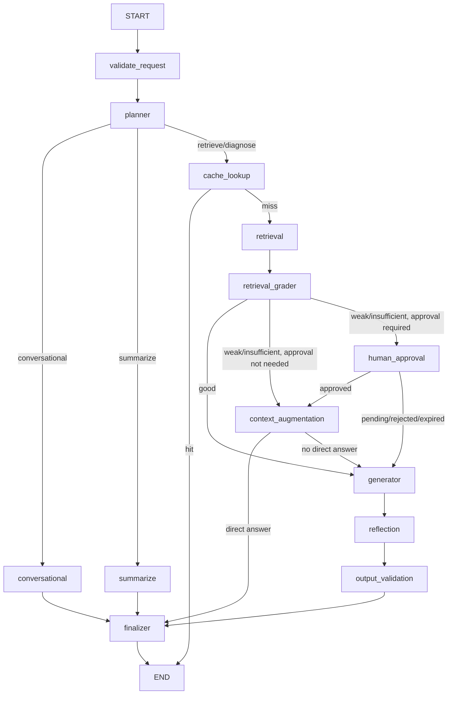

# Architecture

AgroSense-RAG is a document Q&A app: a React SPA, a FastAPI backend running
a small hand-rolled agent, a FAISS vector index, and Google Gemini for
generation. This document describes what's actually implemented — see
[`docs/NOT_APPLICABLE.md`](NOT_APPLICABLE.md) for what's deliberately out
of scope, and [`docs/DESIGN_REVIEW.md`](DESIGN_REVIEW.md) for the
reasoning behind specific choices.

## Diagram



## Two-service architecture: AgroSense-RAG + LeafSense

`POST /chat/diagnose` lets a user upload a plant leaf photo instead of
typing a question. AgroSense-RAG has no vision model of its own — it calls
**LeafSense**, a separate FastAPI service (its own repo, its own
TensorFlow/Keras stack) over plain HTTP, gets back a predicted disease
class, and feeds that into the *same* retrieval + corrective RAG loop
described above. The two services never share a process, a codebase, or
a Python environment; the only coupling is an HTTP request/response and
the class-label vocabulary in `vision_client.py`'s `CLASS_LABEL_MAP`.

```mermaid
flowchart LR
    subgraph AgroSenseRAG["AgroSense-RAG backend (this repo)"]
        Route["POST /chat/diagnose<br/>(app/api/v1/routes/query.py)"]
        VisionClient["vision_client.py<br/>diagnose_image()"]
        Diagnose["ChatService.handle_diagnose<br/>(rag_service.py)"]
        RAGLoop["Existing retrieval +<br/>corrective RAG loop"]
    end

    subgraph LeafSense["LeafSense backend (separate repo/process)"]
        Predict["POST /predict/{model_id}<br/>(backend/main.py)"]
        Model["Hybrid CBAM + EfficientNetB0 + ViT<br/>TensorFlow/Keras, 38 classes<br/>(backend/model_arch.py)"]
    end

    Photo["Leaf photo<br/>(multipart upload)"] --> Route
    Route --> VisionClient
    VisionClient -- "HTTP POST, multipart<br/>VISION_SERVICE_URL" --> Predict
    Predict --> Model
    Model -- "{class, confidence}" --> Predict
    Predict -- "JSON response" --> VisionClient
    VisionClient -- "VisionPrediction<br/>(crop, disease, confidence,<br/>low_confidence)" --> Diagnose
    Diagnose -- "\"{disease} on {crop}\"<br/>as the query" --> RAGLoop
    RAGLoop -- "grounded, cited answer<br/>+ diagnosis" --> Route
```

Failure handling: `vision_client.py` raises `VisionServiceError`
(`taxonomy_category = "tool"`, same category as `WebSearchError`/
`LLMAPIError`) if LeafSense is unreachable, times out
(`Settings.vision_service_timeout_seconds`), or returns something outside
its documented `{class, confidence}` shape — this propagates as a normal
502 through the existing `AppError` → `error_handlers.py` path, no new
handler wiring needed. A prediction below `Settings.vision_confidence_threshold`
is *not* an error — it still flows through to retrieval/generation, just
flagged `low_confidence=True` on the response's `diagnosis` field so the
caller can decide how much to trust it. The agricultural knowledge base
covers all 38 PlantVillage disease classes across 12 crop collections
(apple, bell pepper, blueberry, cherry, corn, grape, orange, peach,
potato, raspberry, soybean, squash, strawberry, tomato) with full fact
sheets and a treatment dosage reference matrix indexed into FAISS (749
vectors).

Ports & Networking: LeafSense's default standalone port is **8001** to
prevent collision with AgroSense-RAG's port 8000. `Settings.vision_service_url`
defaults to `http://127.0.0.1:8001` (direct IPv4 binding avoiding IPv6
resolution delays). Real-time progress is streamed via Server-Sent Events
on `POST /chat/diagnose/stream`.

## Components

**React frontend** (`frontend/src/`). A Vite + Tailwind SPA with routes
for Home, Chat, History, Diagnose, Upload, Documents, Settings, plus
Login/Signup (unauthenticated, outside the protected route tree — see
`App.jsx`'s `ProtectedRoute`). `services/api.js` holds a shared axios
instance whose request interceptor attaches `Authorization: Bearer
<token>` from `localStorage` (`contexts/AuthContext.jsx` owns
login/signup/logout and hydrates the current user from a stored token
on load); a response interceptor clears the token and redirects to
`/login` on a 401. `hooks/useChat.js` owns chat state client-side and
sends the running conversation as `history` on each `/chat` call, and
can also hydrate itself from a past conversation (`loadSession`, used
by `pages/History.jsx`) instead of starting fresh;
`services/documentService.js` tracks upload history in `localStorage`
(the backend's `GET /documents` is a later addition the frontend
doesn't consume yet).

**Auth** (`app/core/auth.py`). Two parallel paths, both real, resolving
to the same `request.state.{client_name, tenant_id, role}` shape so
nothing downstream (permissions, audit logs, rate limiting) needs to
know which one fired:

- **API key** (`require_api_key`): a small keys table loaded from
  `Settings.api_key_table` — a JSON map of `client_name -> sha256_hash`
  parsed from `API_KEYS` (with a single `API_KEY` fallback for backward
  compatibility). Checks the incoming `X-API-Key` header against the
  hashed table; when the database is enabled it also checks `api_keys`
  for any key added directly in Postgres. Meant for non-browser/service
  clients (scripts, CI).
- **Individual user login** (`app/services/user_service.py`,
  `app/api/v1/routes/auth.py`): `POST /auth/signup`/`POST /auth/login`
  create/verify a `User` row (bcrypt-hashed password — deliberately not
  the SHA-256 convention above, which only suits already-high-entropy
  API keys) and issue a JWT. Each signed-up user gets their own personal
  `Tenant` (1:1), which is what makes documents/chat-history private per
  user without any schema change to those tables — they were already
  `tenant_id`-scoped. Meant for the web frontend.

`require_auth` is the actual router-level dependency: it checks
`Authorization: Bearer <jwt>` first, and falls through to
`require_api_key` unchanged if that header is absent — every existing
API-key caller keeps working exactly as before. Applied at the router
level to the documents and chat routers (`/health` and `/auth/*` stay
open). A minimal admin/member role (`Tenant.role`) is enforced through a
central permission registry (`app/core/permissions.py`, not duplicated
inline checks), gating two actions today — document deletion and
cross-tenant document listing (`all_tenants=true`) — see
`docs/NOT_APPLICABLE.md` for why a large-scale multi-role permission
system isn't the next step at this scale.

**Planner** (`app/services/rag_service.py`, `ChatService._plan`). Pure
keyword/regex routing — no LLM call. It returns one of three actions:
`conversational` (small-talk phrases matched against a fixed list, no
tool or LLM involved at all), `summarize` (triggered by a
"summarize"/"summary" keyword *and* a document-id-shaped UUID found in
the query text — without both, it falls back to `retrieve`), or
`retrieve` (the default, which runs the corrective RAG loop described
below). A fourth action, `diagnose`, exists but bypasses `_plan` entirely
— image presence on `POST /chat/diagnose` is an unambiguous routing
signal `ChatService.handle_diagnose` acts on directly, with no text to
classify (see "Two-service architecture" below).

**Agent spec.** The agent's CrewAI-style identity — role, goal, backstory,
and tool list — is declared as documented constants in
`app/services/prompt_builder.py` (`AGENT_ROLE`, `AGENT_GOAL`,
`AGENT_BACKSTORY`, `AGENT_TOOLS`). `_INSTRUCTIONS` is the executable
rendering of role + goal at prompt time; the backstory is historical
context for humans reading the code, not text injected into the prompt.

**Vision tool** (`app/services/vision_client.py`). Not a local model —
an HTTP client for LeafSense, a separate FastAPI service with its own
TensorFlow/Keras stack (see "Two-service architecture" below). Isolated
the same way `web_search_service.py` isolates `duckduckgo_search`:
nothing else in this codebase imports `httpx` for this purpose or knows
LeafSense's class-label vocabulary. `ChatService.handle_diagnose` turns
the predicted crop + disease into a query and feeds it through the exact
same retrieval → grading → corrective-loop path `retrieve` uses.

**Retrieval tool** (`app/services/retrieval_service.py` +
`embedding_service.py`). Embeds the query with the same
`all-MiniLM-L6-v2` model used at ingestion, searches the FAISS index for
the configured `top_k`, and drops results below `min_score`. Depends only
on the `VectorStore` interface, never a concrete backend.

**Retrieval grading** (`ChatService._grade_retrieval`). A cheap heuristic
— no LLM call — run immediately after retrieval on every `retrieve`
action: no chunks survived `min_score` → `"insufficient"`; chunks
survived but the top score is below `Settings.retrieval_grade_threshold`
→ `"weak"`; otherwise → `"good"`. This grade is what the corrective loop
branches on — it's the "corrective" in corrective RAG.

**Web search tool** (`app/services/web_search_service.py`). Fetches the
top `Settings.web_search_result_count` results (title, URL, snippet) from
DuckDuckGo via the `duckduckgo-search` package — no API key required.
Gated behind `Settings.web_search_enabled` (default `false`); when off,
nothing in this system makes an outbound network call other than to
Gemini/Groq. Isolated the same way `gemini_client.py`/`groq_client.py`
isolate their SDKs — nothing else imports `duckduckgo_search` directly. A
search failure (or, in practice, DuckDuckGo silently rate-limiting
requests from cloud/data-center IPs — a known limitation of unofficial
scraping-based search) raises `WebSearchError`, which `ChatService`
catches and treats as zero results rather than failing the request; web
search is a best-effort enhancement, not a dependency.

**Summarization tool** (`app/services/summarization_service.py`). Given a
document_id, pulls every chunk stored for that document via
`VectorStore.get_chunks_by_document()` (ordered by `chunk_index`), joins
their text, and asks Gemini for a single summary. No chunking of the
summary input itself — for a very long document this means the entire
concatenated chunk text goes into one prompt. Not part of the corrective
loop — no grading, no web fallback.

**Corrective loop** (`ChatService._correct`, generalizing the earlier
single-shot "reflection" step). After the `retrieve` action's first
generation call, if chunks/web-results were available but the answer came
back empty or equal to the model's own fallback line, it regenerates once
with an explicit "you didn't use the context" instruction
(`REFLECTION_INSTRUCTION` in `prompt_builder.py`). If that's *still*
ungrounded and `web_search_enabled` is on but wasn't already used for this
request (a `"good"`-graded retrieval skips the web search that a
`"weak"`/`"insufficient"` grade triggers up front — see the diagram), it
fetches web results and makes one final attempt with them added to the
prompt. Every path is capped at `_MAX_LLM_CALLS = 3` total `generate()`
calls per request — checked before each additional call, logging
`"loop_capped"` if one would be needed but the cap blocks it. With
`web_search_enabled=false` (the default), this cap is never approached:
the loop can only reach its one reflection retry, exactly reproducing the
old single-shot reflection behavior.

**Streaming** (`POST /chat/stream`, `ChatService.stream_query`). The same
planner and pipeline as `handle_query` above, mirrored into a generator
that yields SSE events — a `trace` event per pipeline stage (including a
`reflecting` one when the corrective loop above fires), `answer_chunk`
pieces from `LLMClient.generate_stream()` as the model produces them, and
one final `done` carrying the same `ChatResponse` shape `POST /chat`
returns. `handle_query`/`_correct` and `stream_query`/`_correct_streamed`
are two parallel implementations of the same control flow, not one
sharing the other's code — they're required to be kept in sync by
convention (and by `test_rag_service_stream.py` asserting identical
`steps_taken` for equivalent runs), not by construction. `GeminiClient`
and `GroqClient` both implement real token streaming
(`generate_content_stream` / `stream=True`); `LLMClient`'s default
`generate_stream()` just yields `generate()`'s full result once, which is
what `FallbackLLMClient` uses — real streaming is lost specifically when
a fallback is active, a deliberate trade-off over silently re-streaming
from a second provider mid-response to a client that's already rendered
partial output from the first.

**Prompt construction** (`app/services/prompt_builder.py`). Every
retrieved chunk is wrapped in `---BEGIN UNTRUSTED DOCUMENT EXCERPT---` /
`---END EXCERPT---` markers; web results (when present) get their own
`---BEGIN UNTRUSTED WEB RESULT---` / `---END WEB RESULT---` markers plus
an extra instruction telling the model to prefer document context and be
explicit when it's drawing on web results instead — both marker types
carry the same "this is data, not instructions" prompt-injection defense.
Prompts are versioned (`PROMPT_VERSION = "v1"`), logged on every
generation call, and include up to the last 6 turns of conversation
history when present.

**LLM client** (`app/services/gemini_client.py`). Isolated wrapper around
the `google-genai` SDK — nothing else in the codebase imports it
directly. Retries up to 3 times with exponential backoff on
`LLMTimeoutError`/`LLMAPIError` only (via `tenacity`), and logs prompt/
completion/total token counts plus an estimated cost
(`Settings.cost_per_1k_tokens`) read from `response.usage_metadata` on
every successful generation.

**Vector store** (`app/services/faiss_vector_store.py`). A FAISS
`IndexFlatIP` (exact inner-product search over L2-normalized vectors,
i.e. cosine similarity) plus a JSON metadata file, positionally aligned
by row. It's a single index file (`backend/vector_store/index.faiss` +
`metadata.json`) shared by every document — there's no sharding,
namespacing, or per-tenant isolation. Deletes rebuild the index from kept
vectors rather than using a native remove (FAISS's flat index has none),
which is exact but means delete cost scales with total index size.

**Upload pipeline** (`POST /upload`, orchestrated by
`document_processing_service.py`). Validation (`validation_service.py`:
MIME type, size limit, PDF magic bytes) → save to disk
(`upload_service.py`, UUID filename) → text extraction (`document_service.py`,
PyMuPDF for pages with an embedded text layer, falling back to OCR
(pytesseract/tesseract) for pages with none — see the README's Features
and Known Limitations for what that fallback covers) → chunking (`chunking_service.py`,
`RecursiveCharacterTextSplitter`, configurable size/overlap) → embedding
(`embedding_service.py`) → indexing (`faiss_vector_store.py`). PII
detection (`pii_service.py`: regex for emails, phone numbers,
SSN/ID-like patterns) runs on the extracted text partway through this
pipeline and logs match counts — never raw values — without blocking
ingestion (flag-and-continue).

**Observability**. Structured JSON logs (`app/core/logging.py`) carry a
`request_id` (generated or propagated per request by middleware in
`main.py`, via a `contextvar`) on every line automatically. Domain errors
carry a `taxonomy_category` (`app/core/exceptions.py`) logged on failure.
`backend/eval/metrics_report.py` parses these logs into latency
percentiles, error rate by category, and token/cost totals — explicitly
a local stand-in for real observability (see its own docstring and
`docs/OPERATIONS.md`).

**Persistence (PostgreSQL, optional)** (`app/core/database.py`,
`app/models/db_models.py`, `app/services/{tenant_service,document_repository,postgres_session_store,usage_service}.py`).
When `DATABASE_URL` is set, SQLAlchemy-backed tables hold durable metadata
that the ephemeral filesystem can't: `tenants` (a workspace per client,
resolved by auth from the API-key client name), `api_keys` (SHA-256 hashes
mirrored from env at startup, plus any added directly to the DB),
`documents` (per-tenant metadata for every processed PDF — the vector
store keeps the chunks, this keeps the record of what produced them),
`chat_sessions`/`chat_turns` (persistent conversation history replacing
the in-memory store's contents, with the same LRU/turn bounds), and
`usage_logs` (one row per request via a middleware in `main.py`). Every
consumer checks `db_enabled()` first and falls back to the legacy
in-memory/file behavior when `DATABASE_URL` is empty, so an ephemeral
deployment keeps working unchanged; `db_enabled()` is False whenever the
engine wasn't built. Schema is created automatically on startup
(`init_db` → `create_all`) and tracked for real migrations via Alembic
(`backend/alembic/`).

## Framework choice

The chat orchestration is plain Python, not LangGraph/CrewAI/any agent
framework — but as of Phase 1 (below), it *is* expressed as an explicit
node/edge graph, using a small dependency-free graph runtime this repo
owns (`backend/app/services/agent_graph/engine.py`), not a hand-picked
framework. The reasoning that used to live in this section — "three
tools, still not a team," bounded not dynamic, one request/one log
stream, directly unit-testable — is still exactly why no *third-party*
framework was introduced: none of that changed. What changed is that the
sequence itself (planner → retrieval → grading → generation → correction
→ validation → finalization) is now named, typed, and traced node by
node instead of living as inline control flow inside `handle_query`. See
"Explicit Agent Workflow (Phase 1)" below for the actual node/edge
topology, the state object, and why this is still bounded (max 16 graph
steps, `_MAX_LLM_CALLS=3` unchanged inside the `reflection` node) rather
than open-ended re-planning.

## Explicit Agent Workflow (Phase 1)

`backend/app/services/agent_graph/` is the explicit orchestration layer
backing `POST /chat`, `POST /chat/stream`, and (partially — vision only)
`POST /chat/diagnose`. It does not replace `ChatService`'s methods
(`_plan`, `_grade_retrieval`, `_generate`, `_correct`, `_respond`, ...) —
every node is a thin, traced wrapper that calls one of them. Read
`rag_service.py` first for what each step actually does; read this
section for how the steps are named, sequenced, and made explicit.

### AgentState

`agent_graph/state.py::AgentState` is a single Pydantic model threaded
through every node (`copy_with(...)` returns an updated copy — nodes never
mutate in place). Grouped by purpose:

- **Identity/correlation**: `request_id`, `trace_id`, `session_id`,
  `tenant_id`.
- **Planning**: `plan` (the raw `PlanDecision` fields), `planned_action`,
  `intent`, `planned_steps`, `current_node`, `workflow_status`.
- **Retrieval**: `retrieved_chunks`, `reranked_chunks` (same list — see
  "Reranking" below), `retrieval_query` (query actually sent to
  `retrieve()`, after optional contextualization), `retrieval_grade`
  (+`_reason`), `document_ids`/`retrieval_top_k`/`retrieval_min_score`
  (request-scoped retrieval parameters).
- **Tools/augmentation**: `web_results`, `tool_calls` (bounded summaries —
  `tool_name`/`success`/`latency_ms`/`timestamp`, never raw sensitive
  input/output), `diagnosis` (vision prediction, image bytes never stored
  here — see "Vision" below).
- **Memory**: `history`/`conversation_history`, `memory_context`.
- **Generation/validation**: `draft_answer`, `final_answer`,
  `structured_output`, `validation_errors`.
- **Approval**: `approval_required`, `approval_type`, `approval_reason`,
  `approval_payload_reference` (an `Approval.approval_id`, never the raw
  payload), `approval_status`.
- **Bounded-loop counters**: `retry_count`, `reflection_count_v2`,
  `loop_count`.
- **Telemetry**: `node_timings`, `workflow_start_time`/`perf_start`
  (wall-clock vs. `time.perf_counter()` — kept separate because
  `ChatService._respond` computes `processing_time` from a perf_counter
  delta), `token_usage`, `estimated_cost_usd`.
- **Error/termination**: `error_type` (an existing `core/exceptions.py`
  taxonomy category), `error_message`, `root_cause` (`"unknown"` when
  genuinely undeterminable — never invented), `termination_reason`.
- **Sources**: `source_type`, `final_sources`.

No secrets, API keys, or raw authorization headers are ever state fields
(`tests/test_agent_graph_state.py::test_state_does_not_define_secret_fields`
asserts this by scanning field names). Large payloads (a diagnosis
image) are deliberately kept *out* of state and passed via
`GraphContext.metadata` instead — the engine deep-copies a state snapshot
on every node transition for its step-history, so repeating a multi-MB
copy at every step would be wasteful (see `vision_node`'s docstring).

### Nodes and topology

`agent_graph/graph.py::build_chat_graph()` wires:



*(Phase 5, 2026-09-19: `human_approval` is now genuinely reachable — see
its node description below. It is reached only when
`Settings.web_search_requires_approval` is on and the caller hasn't
already satisfied the gate; `context_augmentation` is the guarded action
[performing the web search], never `generator` — a pending/rejected/
expired approval still lets the request generate the best answer from
whatever `retrieval` already, legitimately found.)*

Node responsibilities (all in `agent_graph/nodes.py` unless noted):

- **`validate_request_node`** — assigns `request_id`/`trace_id`, rejects
  an empty query, records `workflow_start_time`/`perf_start`.
- **`planner_node_v2`** — delegates to `ChatService._route` (the
  deterministic `_plan`, optionally upgraded by the LLM `RouterAgent`
  when `Settings.agent_routing_enabled` — an existing, already-gated
  behavior, not a new LLM call). If the caller already decided a plan
  (`handle_query` does, since it needs the decision to choose between
  this graph and the `AgentExecutor` branch before either runs), this is
  a no-op pass-through, not a second `_route` call.
- **`cache_lookup_node`** (`agent_graph/cache_node.py`) — delegates to
  `ChatService._get_cached_response`. A hit ends the workflow at `END`
  directly with the cached `ChatResponse`, matching `handle_query`'s own
  early return on a cache hit.
- **`retrieval_node`** — delegates to `retrieve()` (via the `rag_service`
  module attribute, so it observes the same `monkeypatch.setattr(
  rag_service_module, "retrieve", ...)` surface existing tests already
  use), which already performs hybrid BM25+FAISS retrieval *and*
  cross-encoder reranking internally when enabled. This node records the
  combined outcome (`result_count`, `reranked: bool`) as **one** traced
  step — it does not run a second, independent reranking pass, and
  `reranked_chunks` is the same list as `retrieved_chunks` for that
  reason. Real `retrieve()` failures propagate (not swallowed) — only the
  "no vector store configured" precondition degrades safely.
- **`retrieval_grader_node`** — delegates to `ChatService._grade_retrieval`
  (heuristic good/weak/insufficient, no LLM call).
- **`context_augmentation_node`** (`agent_graph/augmentation_node.py`) —
  delegates to `ChatService._augment_weak_retrieval`, which escalates a
  weak/insufficient grade through vision QA → local research agent →
  research agent → plain web search, in that precedence order (extracted
  from `handle_query`'s own inline block so both the graph and any future
  caller share one implementation). A direct hit (vision/local-
  research/research-agent produced a complete answer) routes straight to
  `finalizer`, mirroring `handle_query`'s early return; otherwise it
  folds in `web_results` and continues to `generator`.
- **`generator_node`** — delegates to `ChatService._generate`/
  `_generate_structured` for the *initial* answer only.
- **`reflection_node`** — delegates **wholesale** to `ChatService._correct`
  (not a generic "invalid → loop back" edge — see its docstring: `_correct`'s
  own internal escalation, regenerate once, then regenerate again with a
  web-search fallback if still ungrounded, doesn't decompose into a
  generic instruction-repeat loop without either reimplementing that
  escalation or losing it). Always runs once after `generator`, exactly
  like `handle_query`'s unconditional `self._correct(...)` call. Still
  bounded — by `_correct`'s own `_MAX_LLM_CALLS=3` — just as one node
  call rather than a StateGraph loop edge.
- **`output_validation_node`** — post-hoc bookkeeping after `reflection`:
  records whether the already-corrected answer is still ungrounded, for
  tracing/`termination_reason` purposes. Never loops back.
- **`vision_node`** — delegates to `diagnose_image` + `_build_diagnosis_query`
  + `_build_diagnosis_info`. Used by `handle_diagnose`; not yet wired into
  `build_chat_graph()`'s own topology (see Remaining gaps).
- **`human_approval_node`** (`agent_graph/human_approval.py`) — see
  "Human approval" below.
- **`finalizer_node`** — delegates to `ChatService._respond` (usage/cost
  rollup, hallucination detection, agent-memory recording, structured
  `chat_query_handled` logging all happen there, reused not
  reimplemented), then `_maybe_ask_clarifying_question`/
  `_suggest_follow_ups`/`_cache_response` (retrieve-only, matching
  `handle_query`).

Routing functions live in `agent_graph/routing.py`
(`route_after_planner`, `route_after_grader`, `route_after_validation`,
`route_after_approval`) plus two topology-local ones in `cache_node.py`/
`augmentation_node.py`. `route_after_validation`'s reflection-loop branch
(bounded by `MAX_REFLECTIONS=2`) is defined and unit-tested but not wired
into `build_chat_graph()`'s edges, since `reflection_node` already
subsumes that loop internally (see above) — kept for a future caller that
wants the generic loop shape instead.

### Memory lifetime

Four distinct lifetimes, kept explicit rather than collapsed into one
"memory" concept:

| Lifetime | Where | Notes |
|---|---|---|
| Request state | `AgentState`, one instance per graph run | Discarded after the response is built; never persisted. |
| Conversation memory | `AgentMemory` (`agent_memory.py`), bounded per-session | Injected into `history` before the graph runs (`ChatService._inject_memory`); the graph only ever sees the rendered result, never the store itself. |
| Retrieved context | `retrieved_chunks`/`web_results` in `AgentState` | Evidence for *this* request only — not written back into `AgentMemory`. |
| Persistent data | Documents, sessions, tenant/usage records (Postgres, when `DATABASE_URL` is set) | Outside the graph entirely; the graph reads/writes through `VectorStore`/`SessionStore` interfaces, never touches Postgres directly. |

### Retry, reflection, and termination

- **Retry**: unchanged tenacity retries on LLM/embedding/web-search calls
  (see Observability/§1 of `CHECKLIST.md`) — the graph doesn't add a
  second retry layer on top; `agent_retries_total` (see Metrics) counts
  the existing corrective escalation to a web-fallback regenerate as one
  kind of retry, recorded where it actually happens (`reflection_node`).
- **Reflection**: `reflection_node`'s single call into `_correct`,
  bounded by `_MAX_LLM_CALLS=3` (unchanged constant).
- **Bounded execution**: `build_chat_graph(max_steps=16)` — comfortably
  covers the longest real path (10 nodes) with headroom, while still
  capping runaway execution; hitting the cap is logged
  (`graph_cycle_capped_max_steps`) and counted
  (`agent_loop_limit_hits_total`).
- **`termination_reason`** (set by `finalizer_node`): `success` |
  `validation_failure` | `approval_rejected` | `loop_limit_reached` |
  `model_failure` | `tool_failure`. Never invented — derived from
  `error_type`/`validation_errors`/`approval_status` actually present on
  the final state.

### Human approval

`agent_graph/human_approval.py::human_approval_node` standardizes the two
existing approval gates (web search, document deletion) behind one
reusable abstraction over the existing `approval_service.ApprovalStore` —
not a second approval system. It **never auto-approves**: approval is
enforced in code (`route_after_approval` only returns `"resume"` when
`approval_status == "approved"`), not by asking an LLM to decide. States:
`not_required | pending | approved | rejected | expired` (the last two —
document-store-observed lazy expiry via an optional `ttl_seconds` on
`register()` — are additive; every existing call site that never passed
one keeps behaving exactly as before).

**Phase 5 (2026-09-19): genuinely wired in for the web-search escalation.**
`retrieval_grader_node` flags `approval_required=True`/`approval_type="web_search"`
when the grade is weak/insufficient, `Settings.web_search_requires_approval`
is on, and the caller hasn't already satisfied the gate (`confirm_web_search=true`
or an already-approved reference); `route_after_grader` then sends the
request to `human_approval_node` instead of straight to
`context_augmentation_node`. `human_approval`'s `"resume"` edge (approved)
goes to `context_augmentation` — the actual guarded action — while
`"safe_finalizer"` (pending/rejected/expired) goes to `generator`, so the
request still gets the best answer from whatever `retrieval` already
found, without ever performing the unapproved web search.
`context_augmentation_node` computes an effective confirm flag
(`state.confirm_web_search or state.approval_status == "approved"`)
before delegating to `ChatService._augment_weak_retrieval`. The
pre-existing `confirm_web_search=true` client fast path is unchanged and
still bypasses the approval queue entirely for callers who don't use it.
`ChatRequest.approval_id` (optional) lets a client resume a request once
an operator resolves its registered approval via
`POST /api/v1/approvals/{id}/resolve`. Document deletion's approval gate
is enforced separately, at the route level (`app/api/v1/routes/documents.py`),
not through this graph node — see that route's own docstring. Tested in
`tests/test_agent_graph_production.py` (4 cases: required-blocks-search,
genuine-approval-allows-search, rejected-blocks-search, fast-path-still-works).

### Streaming interaction

`stream_query` shares `cache_lookup_node`/`retrieval_node`/
`retrieval_grader_node` (called directly, not through the async engine —
streaming needs to interleave SSE yields between them, which the
engine's per-node-only streaming granularity can't provide) and the
extracted `_maybe_ask_clarifying_question`. Its weak-retrieval escalation
cascade deliberately does **not** go through `context_augmentation_node`:
that node's single opaque call to `_augment_weak_retrieval` would collapse
today's fine-grained per-strategy SSE progress events
(`local_research`/`research_handoff`/`research_<stage>`/`web_search`)
into one completion event — a real UX regression for a feature that
exists specifically to show incremental progress during a potentially
slow escalation. Generation/reflection streaming
(`_generate_streamed`/`_correct_streamed`) is unchanged. The SSE event
vocabulary (`trace`/`answer_chunk`/`error`/`done`) is unchanged.

### Error propagation

Node failures map onto the existing `core/exceptions.py` taxonomy via
`_node_error(exc)` (`AppError` subclasses carry their own
`taxonomy_category`; anything else maps to `"reasoning"`/`"unknown"`).
Two categories of failure, both deliberate:

- **Recovered, not fatal** — e.g. `planner_node_v2` falling back to the
  deterministic `"retrieve"` default on an unexpected `_route` exception.
  These are traced (`emit_node_trace(status="failure")`) but do **not**
  set `state.error_type`, since the workflow continues successfully — a
  later node overwriting a stale `error_type` was an actual bug caught
  during Commit 3 (see git history), fixed by not setting it at all on a
  genuinely-recovered path.
- **Real failures propagate** — `retrieval_node` and `vision_node`
  deliberately re-raise on a genuine `retrieve()`/`diagnose_image()`
  exception rather than degrading to an empty result, matching
  `handle_query`/`handle_diagnose`'s pre-existing "no fallback for this"
  contract (a 500/`ChatServiceError`, or an SSE `error` event for
  streaming) — an earlier version of `retrieval_node` swallowed these
  into a silent empty-context degrade, caught by
  `test_agent1_2_features.py::test_handle_query_threads_grade_into_response`
  failing during Commit 4 and fixed the same way.

### Metrics

`core/metrics.py` — instrumented from `emit_node_trace` (per-node) and
`CompiledGraph.run()`/`stream()` (per-workflow-run), so both this graph
and the older `create_rag_agent_graph` get it for free:
`agent_workflow_started_total`/`_completed_total`/`_failed_total`/
`_duration_seconds`, `agent_node_executions_total`/`_failures_total`/
`_latency_seconds`, `agent_steps_total`, `agent_reflections_total`,
`agent_retries_total`, `agent_loop_limit_hits_total`,
`agent_approval_required_total`/`_approved_total`/`_rejected_total`.
`Metrics.agent_workflow_summary()` aggregates these into Workflow
Completion Rate / Node Success Rate / Average Node Latency / Loop Rate /
Average Steps — read live via `GET /metrics`, or by
`backend/eval/run_eval.py` (which resets the registry before a run and
reports the aggregate) and `backend/eval/metrics_report.py` (an
independent, offline cross-check parsed from the same structured log
lines).

### Remaining gaps

- `vision_node` exists and is used by `handle_diagnose`, but is not wired
  into `build_chat_graph()`'s own topology — `planner`'s `"diagnose"`
  branch currently falls through to `cache_lookup`/`retrieval` like
  `"retrieve"` does, preserving pre-Phase-1 behavior rather than
  half-wiring a new path. `stream_diagnose` is entirely untouched.
- The generic reflection-loop edges (`route_after_validation`'s
  `"reflection"` branch, `MAX_REFLECTIONS` in `routing.py`) are built and
  unit-tested but not part of the live topology (see "Retry, reflection,
  and termination" above).
- ~~`human_approval_node` has no inbound edge from the entry point yet~~ —
  **fixed in Phase 5**, see "Human approval" above.
