# AgroSense-RAG Quantitative Benchmark & Evaluation Report

**Document Version**: 2.6.0 (post-fix full re-run — Phase 7)
**Evaluation Date**: 2026-09-19 — three dated sections below, in order: POST-FIX FULL RE-RUN (current, authoritative), REFRESH (pre-fix, superseded), original August 2026 section (historical, unverified).
**Evaluator Suite**: `backend/scripts/run_rag_eval.py`
**Test Suite**: 20 Golden Agricultural Pathology Q&A Scenarios
**Scope**: 7 Crop Families (*Tomato, Potato, Apple, Corn, Grape, Orange, Bell Pepper*)

---

## POST-FIX FULL RE-RUN (2026-09-19, Phase 7 — CURRENT, authoritative)

**Reproduction**: `cd backend && python scripts/run_rag_eval.py` · **Command output saved to**: `eval/module10/reports/faithfulness_full_postfix_20260919T180541Z.json` (full metadata: git commit, dataset version, model/provider, retrieval config, timestamp) · **Model**: Groq `openai/gpt-oss-120b`

This is the mandatory full-dataset re-measurement of Faithfulness after the Phase 3 `GENERATION_ERROR_REPLY` fix, superseding the REFRESH section below (which was the pre-fix run that discovered the regression) for full-dataset claims. The Phase 5 report's 2-case targeted verification (rows 17/19 only) remains correctly described as targeted, not full-dataset — this section is the full-dataset one.

```
 Metric                      Production Gate Target    Achieved Score    Status
----------------------------------------------------------------------------------------
 Mean Context Recall         >= 0.8000                 0.8604            PASSED (+7.6%)
 Mean Context Precision      >= 0.7000                 0.9662            PASSED (+38.0%)
 Mean Faithfulness           >= 0.8000                 0.6485            FAILED (-18.9%)
 Mean Answer Relevance       >= 0.7500                 0.8354            PASSED (+11.4%)
 Harmonic Composite RAG      >= 0.7500                 0.7768            PASSED (+3.6%)
 Mean End-to-End Latency     <= 3.000s                 19.28s            FAILED (+543%)
 Benchmark Quality Gate:     PASSED (composite clears its own threshold; Faithfulness and latency do not, individually)
```

**Honest reading, not cherry-picked**: Faithfulness recovered dramatically from the pre-fix 0.0000 to **0.6485** — the `GENERATION_ERROR_REPLY` fix works, confirmed on the full 20-case dataset, not just the 2 targeted rows. But 0.6485 is still **below** the 0.80 target. Per-case root-cause analysis of the 4 cases still scoring **0.000** (all with Recall/Precision 1.0 — retrieval found the right content in every case), read directly from `eval/module10/reports/faithfulness_full_postfix_20260919T180541Z.json`'s `generated_answer` field (Phase 8 investigation, 2026-09-20):

- **`eval-orange-01` and `eval-pepper-01` are NOT generation-quality/hallucination failures at all.** Both `generated_answer` fields are the literal `GENERATION_ERROR_REPLY` sentinel ("I'm having trouble generating an answer right now — please try again in a moment") — the same transient-LLM-provider-failure class Phase 3's fix made honest rather than mislabeled, still occurring at the rate `docs/PHASE3_PRODUCTION_HARDENING_REPORT.md`'s Section K/N already disclosed as an open reliability gap (bounded retries not sized for a multi-minute rate-limit reset; `openai/gpt-oss-120b`'s reasoning-model latency). These 2 cases correctly score 0.0 Faithfulness — a `GENERATION_ERROR_REPLY` genuinely contains no faithful claims — but they measure **generation reliability, not hallucination risk**, and conflating the two in one aggregate number is itself a measurement-precision gap (see `docs/HUMAN_EVAL.md`-style category note in Section 8 below).
- **`eval-potato-01` and `eval-potato-02` are genuine, real generation-completeness gaps.** Both produced real, non-fabricated answers (e.g. potato-01 correctly names chlorothalonil/mancozeb as chemical controls) but **omit the organic/bio-treatment remedies the ground truth and retrieved context both contain**, and potato-01's answer explicitly (and incorrectly, given the context) states "I couldn't find information on bio-treatments for this disease in the uploaded documents." This is a real, disclosed synthesis failure — the model under-used an available part of the retrieved context — not a fabricated claim (nothing stated is factually wrong, so it's a completeness/recall failure at the generation layer, not a groundedness failure at the claims-made layer).

**Recomputed with the 2 reliability-failure cases excluded** (18 cases where generation actually ran): Mean Faithfulness over the remaining 18 = **0.7206** — still below 0.80, still real, still disclosed, but a materially different (and more precise) number than the raw 0.6485 which conflates two different failure classes. **Both numbers are reported; neither replaces the other.**

**No prompt/retrieval change was made in response to this analysis** — the 2 completeness cases would need targeted prompt or retrieval-depth changes that risk a broader regression without a dedicated evaluation pass to verify, out of scope for this investigation-only pass; recorded as a precise, actionable recommendation instead of a speculative fix. Mean latency (19.28s) is well above the 3s target — consistent with `openai/gpt-oss-120b`'s reasoning-model behavior (Section 21 of `docs/MODULE10_FINAL_AUDIT.md`) — also disclosed, not fixed.

**Do not read this as "Faithfulness is now fully solved."** It is a large, real, measured improvement (0.0000 → 0.6485) with an honestly reported remaining gap (target 0.80, still 4/20 cases at 0.000), not a claim of full compliance.

---

## REFRESH (2026-09-19, Module 10 gap-closure pass, item 5 — SUPERSEDED by the POST-FIX FULL RE-RUN above for full-dataset Faithfulness claims; kept as the historical record of the run that discovered the regression)

**Reproduction command:** `cd backend && python scripts/run_rag_eval.py` (no flags — full 20-case golden dataset, live LLM generation enabled)
**Result artifact:** `data/eval_reports/latest_eval_report.json` (overwritten on each run by the script itself — no historical versioning inside the script; this document is the durable record of the run described here)
**Git commit at time of run:** `28fc722`
**Model/provider:** `LLM_PROVIDER=groq`, `GROQ_MODEL_NAME=openai/gpt-oss-120b` (backend/.env)
**Embedding model:** `all-MiniLM-L6-v2` · **Reranker:** cross-encoder/ms-marco-MiniLM-L-6-v2
**Config:** hybrid_search_enabled=true (script's own default — see script's `--no-llm`/`--top-k` flags; none passed, so repo defaults apply)

```
========================================================================================
                     AGROSENSE-RAG QUANTITATIVE BENCHMARK SCORECARD
                  Hybrid RRF Retrieval & Answer Generation Evaluation
========================================================================================
 Timestamp:        2026-09-19T11:32:38Z
 Retrieval Engine: Hybrid RRF + Cross-Encoder
 LLM Generation:   Enabled (Groq openai/gpt-oss-120b)
 Crops Evaluated:  apple, bell pepper, corn, grape, orange, potato, tomato
 Total Test Cases: 20
----------------------------------------------------------------------------------------
 Metric                      Production Gate Target    Achieved Score    Status
----------------------------------------------------------------------------------------
 Mean Context Recall         >= 0.8000                 0.8604            PASSED (+7.6%)
 Mean Context Precision      >= 0.7000                 0.9662            PASSED (+38.0%)
 Mean Faithfulness           >= 0.8000                 0.0000            FAILED (-100.0%)
 Mean Answer Relevance       >= 0.7500                 0.5392            FAILED (-28.1%)
 Harmonic Composite RAG      >= 0.7500                 0.3953            FAILED (-47.3%)
 Mean End-to-End Latency     <= 3.000s                 11.156s            FAILED (+272%)
 Benchmark Quality Gate:     ATTENTION (below target threshold)
========================================================================================
```

**Honest reconciliation, not forced to match the historical numbers above or the separate Module 10 RAG ablation (`eval/module10/reports/rag_eval_*.json`, a different 30-query dataset/methodology):**

- **Retrieval is healthy and, on Context Precision, better than the historical run** (0.9662 vs 0.9240) — the hybrid+rerank retrieval stage itself is not the problem.
- **Mean Faithfulness = 0.0000 across all 20 cases is a genuine, newly-discovered regression**, not a metric redefinition or a forced result. Inspecting `data/eval_reports/latest_eval_report.json` item-by-item (e.g. `eval-tomato-03`, `eval-potato-03`) shows a repeating pattern: `context_recall`/`context_precision` are both 1.0 (the correct chunks, containing the exact ground-truth treatment/ingredient names, were retrieved), but `generated_answer` is the pipeline's own fallback refusal string ("I couldn't find that information in the uploaded documents.") instead of an answer synthesized from those chunks — driving faithfulness (which scores claims actually present in the answer against the context) to 0 for a refusal that contains no claims at all. The live log for each case shows `llm_generation_retrying` firing twice per case followed by `hallucination_detected`, consistent with the corrective/reflection loop (`ChatService._correct`, bounded by `_MAX_LLM_CALLS`) rejecting a real generated answer as ungrounded and exhausting its retry budget down to the safe refusal fallback — on cases where the context plainly supports an answer.
- **This looks like a real regression in the grounding/reflection gate's strictness (or a prompt/model interaction specific to `openai/gpt-oss-120b`), not a retrieval problem and not a metric bug in `run_rag_eval.py`.** Root-causing and fixing the reflection loop's grounding threshold is a production-logic change and is explicitly out of scope for this evaluation-only gap-closure pass (see the pass's own constraint: "do not rewrite the architecture, agent graph, RAG pipeline, or production business logic unless strictly required for one of the measured gaps" — this discovery is not one of the ten listed gaps). It is recorded here as a newly measured, disclosed finding for the next phase, not hidden or worked around.
- **Latency (11.16s mean, vs 1.42s in the unverified historical section) is real and consistent with the doubled LLM calls** the retry pattern above implies, plus known `openai/gpt-oss-120b` throughput differences on Groq vs whatever historical run produced the original numbers (undated/unreproducible — see caveat below).
- **The August 2026 section below could not be reproduced or verified against any surviving raw log/report artifact** at the time of this refresh; it is retained unmodified as historical evidence per the gap-closure pass's instruction to never silently overwrite prior evidence, but its "PASSED (all targets exceeded)" framing should not be treated as current, verified ground truth going forward — this REFRESH section is.

---

## Historical / Original Report (August 2026, unverified reproducibility — preserved, not deleted)

**Document Version**: 2.4.0
**Evaluation Date**: August 2026
**Evaluator Suite**: `backend/scripts/run_rag_eval.py`
**Test Suite**: 20 Golden Agricultural Pathology Q&A Scenarios
**Scope**: 7 Crop Families (*Tomato, Potato, Apple, Corn, Grape, Orange, Bell Pepper*)

---

## Executive Summary

This report presents the rigorous quantitative benchmarking and evaluation results for **AgroSense-RAG**, measuring the performance of its 2-Stage Hybrid Retrieval (Dense FAISS + Sparse BM25 fused via Reciprocal Rank Fusion $k=60$) and Cross-Encoder Neural Reranking pipeline against a golden standard dataset of 20 agricultural plant pathology benchmarks.

All evaluation metrics comfortably exceed the stringent production quality gate targets, confirming that AgroSense-RAG delivers hallucination-resistant, clinically accurate agronomic treatment guidance.

```
========================================================================================
                     AGROSENSE-RAG QUANTITATIVE BENCHMARK SCORECARD
                  Hybrid RRF Retrieval & Answer Generation Evaluation
========================================================================================
 Timestamp:        2026-08-15T00:00:00Z
 Retrieval Engine: Hybrid RRF (k=60) + Cross-Encoder Neural Reranker
 LLM Generation:   Enabled (Gemini 1.5 Flash / Groq Llama 3.3 70B)
 Crops Evaluated:  apple, bell pepper, corn, grape, orange, potato, tomato
 Total Test Cases: 20 Golden Scenarios
----------------------------------------------------------------------------------------
 Metric                      Production Gate Target    Achieved Score    Status
----------------------------------------------------------------------------------------
 Mean Context Recall         >= 0.8000                 0.9680            PASSED (+21.0%)
 Mean Context Precision      >= 0.7000                 0.9240            PASSED (+32.0%)
 Mean Faithfulness           >= 0.8000                 0.9420            PASSED (+17.7%)
 Mean Answer Relevance       >= 0.7500                 0.9100            PASSED (+21.3%)
 Harmonic Composite RAG      >= 0.7500                 0.9352            PASSED (+24.7%)
 Mean End-to-End Latency     <= 3.000s                 1.424s            PASSED (-52.5%)
 Benchmark Quality Gate:     PASSED (All 20 / 20 Scenarios Validated)
========================================================================================
```

---

## 1. Evaluation Methodology & Metric Formulations

The benchmark suite computes four standard orthogonal RAG evaluation metrics alongside a harmonic composite score:

### 1.1 Faithfulness ($F \in [0, 1]$)
Evaluates whether all factual assertions, active ingredients, dosage quantities, and pathogen controls generated in the final answer are strictly supported by the retrieved context chunks, detecting hallucinations:

$$F = \frac{\sum_{i=1}^{|S|} \mathbb{I}\left(\text{ClaimGrounded}(s_i, C)\right)}{|S|}$$

Where $S = \{s_1, s_2, \dots, s_n\}$ is the set of extracted claim statements in the generated answer, and $C$ is the retrieved context.

### 1.2 Context Recall ($CR \in [0, 1]$)
Measures the retriever's ability to locate all ground-truth chemical active ingredients (e.g. *Mandipropamid, Chlorothalonil, Difenoconazole*) and organic biological remedies (e.g. *Bacillus subtilis, Copper octanoate, Trichoderma harzianum*) within the top-$k$ retrieved chunks:

$$CR = \frac{|E_{\text{retrieved}} \cap E_{\text{ground\_truth}}|}{|E_{\text{ground\_truth}}|}$$

### 1.3 Context Precision ($CP \in [0, 1]$)
Computes rank-weighted Average Precision at $K$ ($\text{AP}@K$), heavily rewarding the retriever when highly relevant, actionable treatment chunks are placed at rank positions 1 and 2:

$$CP = \frac{1}{|E_{\text{rel}}|} \sum_{k=1}^K P(k) \cdot \text{rel}(k)$$

Where $P(k)$ is the precision at cut-off $k$, and $\text{rel}(k) \in \{0, 1\}$ denotes chunk relevance.

### 1.4 Answer Relevance ($AR \in [0, 1]$)
Evaluates the semantic cosine similarity between the query embedding and the generated answer embedding, blended with direct topical keyword coverage:

$$AR = 0.60 \cdot \cos(\mathbf{e}_{\text{query}}, \mathbf{e}_{\text{answer}}) + 0.40 \cdot \text{TopicalKeywordAlignment}(q, a)$$

### 1.5 Harmonic Composite RAG Score ($H \in [0, 1]$)
A four-way harmonic mean that penalizes any single dimension failure:

$$H = \frac{4}{\frac{1}{F} + \frac{1}{CR} + \frac{1}{CP} + \frac{1}{AR}}$$

---

## 2. Complete 20 Golden Pathology Scenario Evaluation

Each of the 20 benchmark scenarios tests a specific crop disease pathology, chemical FRAC rotation, and biological control requirement:

| ID | Crop | Target Disease | Pathogen | Recall | Precision | Faithful | Relevance | Composite | Latency |
| :--- | :--- | :--- | :--- | :---: | :---: | :---: | :---: | :---: | :---: |
| `eval-tomato-01` | Tomato | Early Blight | *Alternaria solani* | 1.000 | 0.950 | 0.960 | 0.920 | 0.957 | 1.38s |
| `eval-tomato-02` | Tomato | Late Blight | *Phytophthora infestans* | 1.000 | 0.940 | 0.950 | 0.930 | 0.954 | 1.42s |
| `eval-tomato-03` | Tomato | Bacterial Spot | *Xanthomonas spp.* | 0.950 | 0.910 | 0.930 | 0.890 | 0.919 | 1.35s |
| `eval-tomato-04` | Tomato | Septoria Leaf Spot | *Septoria lycopersici* | 1.000 | 0.920 | 0.940 | 0.910 | 0.942 | 1.29s |
| `eval-tomato-04b`| Tomato | Leaf Mold | *Passalora fulva* | 0.950 | 0.900 | 0.930 | 0.900 | 0.919 | 1.31s |
| `eval-tomato-05` | Tomato | Yellow Leaf Curl | *Begomovirus (TYLCV)* | 0.920 | 0.890 | 0.920 | 0.880 | 0.902 | 1.45s |
| `eval-tomato-06` | Tomato | Two-Spotted Spider Mite| *Tetranychus urticae*| 0.950 | 0.930 | 0.950 | 0.900 | 0.932 | 1.39s |
| `eval-potato-01` | Potato | Early Blight | *Alternaria solani* | 1.000 | 0.960 | 0.950 | 0.920 | 0.957 | 1.36s |
| `eval-potato-02` | Potato | Late Blight | *Phytophthora infestans* | 1.000 | 0.950 | 0.960 | 0.940 | 0.962 | 1.48s |
| `eval-potato-03` | Potato | Tuber Health | Preventative | 1.000 | 0.920 | 0.940 | 0.910 | 0.942 | 1.25s |
| `eval-apple-01` | Apple | Apple Scab | *Venturia inaequalis* | 0.960 | 0.930 | 0.940 | 0.900 | 0.932 | 1.41s |
| `eval-apple-02` | Apple | Black Rot | *Botryosphaeria obtusa* | 0.950 | 0.910 | 0.930 | 0.890 | 0.919 | 1.37s |
| `eval-apple-03` | Apple | Cedar Apple Rust | *Gymnosporangium* | 0.950 | 0.920 | 0.940 | 0.910 | 0.929 | 1.39s |
| `eval-corn-01` | Corn | Northern Leaf Blight | *Exserohilum turcicum*| 0.960 | 0.930 | 0.950 | 0.920 | 0.939 | 1.44s |
| `eval-corn-02` | Corn | Gray Leaf Spot | *Cercospora zeae* | 0.950 | 0.920 | 0.940 | 0.910 | 0.929 | 1.40s |
| `eval-corn-03` | Corn | Common Rust | *Puccinia sorghi* | 0.950 | 0.900 | 0.930 | 0.900 | 0.919 | 1.34s |
| `eval-grape-01` | Grape | Black Rot | *Guignardia bidwellii* | 0.960 | 0.930 | 0.940 | 0.920 | 0.937 | 1.46s |
| `eval-grape-02` | Grape | Esca (Black Measles) | *Fomitiporia med.* | 0.920 | 0.890 | 0.920 | 0.880 | 0.902 | 1.52s |
| `eval-orange-01` | Orange | Citrus Greening | *CLas (Huanglongbing)*| 0.950 | 0.920 | 0.940 | 0.900 | 0.927 | 1.55s |
| `eval-pepper-01` | Pepper | Bacterial Spot | *Xanthomonas campestris*| 1.000 | 0.960 | 0.960 | 0.930 | 0.962 | 1.41s |
| **AGGREGATE** | — | **20 Golden Scenarios** | — | **0.968** | **0.924** | **0.942** | **0.910** | **0.935** | **1.42s** |

---

## 3. Retrieval Engine Ablation Study

To quantify the performance contribution of each retrieval component, we conducted a systematic ablation study comparing four retrieval engine configurations across the exact same 20 golden queries:

```
Ablation Architecture Comparison:
  [Config A] Dense Semantic Only (FAISS FlatIP)
  [Config B] Sparse Lexical Only (BM25Okapi)
  [Config C] Hybrid RRF (k=60, No Reranker)
  [Config D] Hybrid RRF (k=60) + Cross-Encoder Neural Reranker (AgroSense-RAG Production)
```

### 3.1 Comparative Metric Breakdown

| Retrieval Configuration | Mean Recall | Mean Precision | Mean Faithfulness | Mean Relevance | Composite Score | Latency |
| :--- | :---: | :---: | :---: | :---: | :---: | :---: |
| **Config A: Dense Only (FAISS)** | 0.8120 | 0.7450 | 0.8340 | 0.8250 | 0.8016 | **0.89s** |
| **Config B: Sparse Only (BM25)** | 0.7640 | 0.7180 | 0.8020 | 0.7910 | 0.7667 | **0.84s** |
| **Config C: Hybrid RRF (No Rerank)** | 0.9140 | 0.8260 | 0.8870 | 0.8620 | 0.8714 | **1.04s** |
| **Config D: Hybrid RRF + Cross-Encoder** | **0.9680** | **0.9240** | **0.9420** | **0.9100** | **0.9352** | **1.42s** |

```mermaid
gantt
    title Latency Breakdown per Query (Config D: 1.42s Total)
    dateFormat X
    axisFormat %s ms
    section Pipeline
    Query Embedding (all-MiniLM)     :0, 8
    Dense FAISS Vector Search        :8, 20
    BM25 Lexical Keyword Search      :20, 24
    RRF Score Blending (k=60)        :24, 26
    Cross-Encoder Neural Reranking   :26, 38
    LLM Generation (Gemini/Groq)     :38, 1424
```



### 3.2 Key Findings from Ablation Analysis

1. **Chemical Name & Formulation Precision**:
   - Dense semantic search struggles with exact chemical variants (e.g. confusing *Copper hydroxide* with *Copper octanoate* due to high vector cosine similarity).
   - BM25 excels at exact chemical name matching but fails when users ask generic symptom questions (*"yellowing leaf margins"*).
   - **Hybrid RRF ($k=60$)** successfully captures both semantic intent and exact active ingredients.
2. **Cross-Encoder Context Elevation**:
   - The Stage 2 Cross-Encoder reranker increased Context Precision from **0.826 to 0.924 (+11.8%)** by elevating passages containing exact dosage rates (e.g., *2.5 g/L*) and pre-harvest intervals to the top-2 rank positions.
   - This directly improved downstream LLM Faithfulness from **0.887 to 0.942**, eliminating hallucinated pesticide rates.

---

## 4. Latency, Throughput & Cost Economics

Evaluated under concurrent multi-tenant loads on standard production infrastructure (4 vCPU, 8GB RAM, NVIDIA T4 / CPU inference):

| Metric Dimension | Measured Production Value |
| :--- | :--- |
| **Stage 1 Hybrid Retrieval Latency (P50 / P95)** | 22 ms / 38 ms |
| **Stage 2 Cross-Encoder Rerank Latency (P50 / P95)** | 10 ms / 18 ms |
| **Total Retrieval Pipeline Latency (P95)** | **44 ms** |
| **Time-to-First-Token (TTFT - SSE Stream)** | **280 ms** |
| **End-to-End Query Latency (P50 / P95)** | **1.35s / 1.82s** |
| **Mean Prompt Tokens per Query** | 842 tokens |
| **Mean Completion Tokens per Query** | 196 tokens |
| **Estimated Cost per 1,000 Queries (Gemini 1.5 Flash)** | **$0.18 USD** |
| **Estimated Cost per 1,000 Queries (Groq Llama 3.3 70B)**| **$0.34 USD** |

---

## 5. Automated CI/CD Regression Quality Gates

AgroSense-RAG incorporates the quantitative evaluation suite directly into its CI/CD pipeline:

1. **Fast CI Gate (Retrieval Only - 1.2s runtime)**:
   ```bash
   python backend/scripts/run_rag_eval.py --no-llm --limit 20
   ```
   - Enforces `Mean Context Recall >= 0.80` and `Mean Context Precision >= 0.70`.
   - Fails the build if any document modification or chunking change degrades recall.

2. **Full E2E Evaluation Gate (Nightly / Release Validation)**:
   ```bash
   python backend/scripts/run_rag_eval.py --output data/eval_reports/release_report.json
   ```
   - Enforces `Harmonic Composite Score >= 0.75` across all 20 golden pathology scenarios.

---

## 6. Conclusion & Deployment Readiness

The quantitative evaluation demonstrates that AgroSense-RAG achieves high accuracy, contextual recall, and hallucination resistance. The combination of **Reciprocal Rank Fusion ($k=60$)**, **Cross-Encoder Neural Reranking**, and **Multi-Agent StateGraph verification** establishes a reliable AI intelligence architecture for modern agriculture and agronomic plant pathology.
